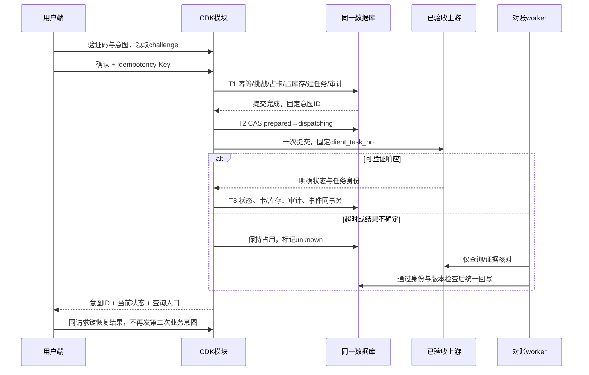
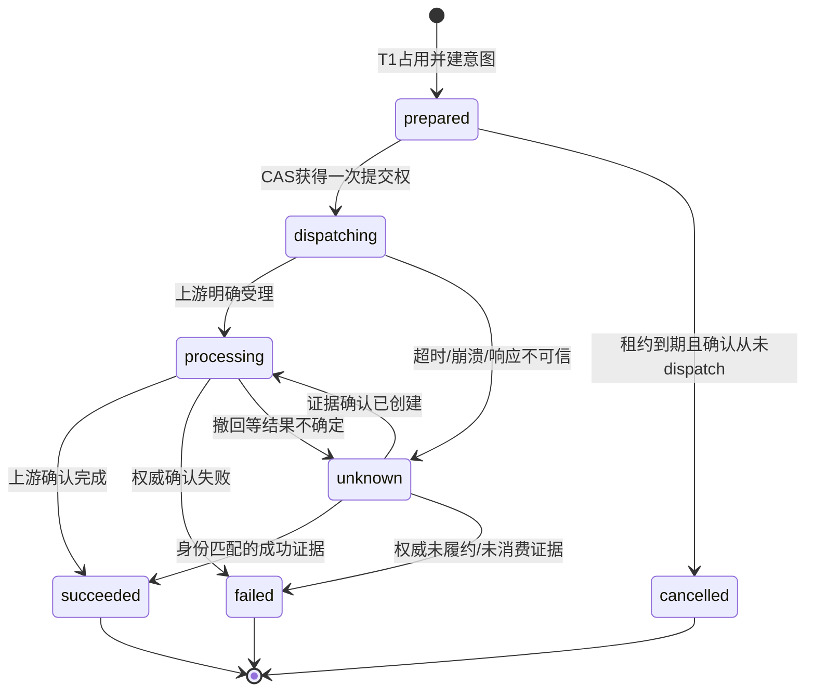

# CDK 卡密与充值中心端到端产品及技术方案

日期：2026-09-25。适用入口：`/recharge`、`/admin`；邮箱管理仍为 `/Googlemail`。本文保留设计时的现状基线和完整目标，不代表所有拟议能力已经交付。**后续实现已落地首期 CDK 闭环并部署到测试服务器**，新增 `/admin/cdk`、`/recharge/cdk`；实际模型、接口、规模限制、验证结果及部署步骤以 [实现与操作手册](cdk-implementation-and-operations-2026-09-25.md) 为准。服务器账号与在线验收见 [部署记录](cdk-server-deployment-2026-09-25.md)；P1/P2 与外部生产验收仍未完成。

结论：现有系统具备上游卡密验证与履约任务管理基础，但没有本地卡密发行、库存、领取、核销账和独立客户身份。推荐先交付“受控上游库存支撑的单次、定额权益兑换码”，复用 Flask/SQLAlchemy、现有充值服务及 React 页面。不得将任意随机字符串直接当作可在上游充值的卡密，不得把充值任务、Google 邮箱账号、平台客户和支付账本混为一体。

优先级约定：**M / P0 必须实现**＝新 CDK 闭环放行条件；**S / P1 建议实现**＝首期后运营增强；**L / P2 后续优化**＝新业务或规模化能力。P0 只约束准备开放的新功能，不追溯阻断用户已授权的 HTTP 合成测试。本文中的限额、工期、保留时长是建议初值，不能当作已有性能、合同或合规结论。

## 1. 现状分析

### 1.1 核查基线与证据索引

基线为当前**未提交工作区**，不是仅检查 HEAD `b04f53615a7b4915fb90dd446f1a80d985cc1ba6`。保留已有改动。以下路径和行号均以本轮读取时为准，后文用 E 编号引用对应事实。

| 证据 | 文件与行号 | 已确认事实 |
| --- | --- | --- |
| E01 | `requirements.txt:1`；`frontend/package.json:1`；`Dockerfile:1` | Flask 3.1.3、Flask-SQLAlchemy 3.1.1、SQLAlchemy 2.0.51；React 18、Vite 6、Tailwind；Python Web 与 Node/Playwright 邮箱自动化共仓 |
| E02 | `app/routes/main.py:79`；`frontend/src/App.jsx:5` | 三入口分流；无单独充值管理前端工程 |
| E03 | `frontend/src/components/RechargeView.jsx:170`、`:512`、`:586` | 用户页含提交、进度、账单续费、教程；校验→挑战→下单；提交异常提示先查单 |
| E04 | `app/routes/recharge.py:172`、`:192`、`:213`、`:313`、`:365`、`:415`、`:502` | 已有验证、挑战、创建、查单、撤回/关闭、收据和上游账单工具接口 |
| E05 | `app/services/recharge_service.py:149`、`:182`、`:353` | disabled/mock/live 三模式；live 调上游验证，mock 按输入词段模拟套餐；仅接受 valid/unused 验证状态 |
| E06 | `app/models/recharge_task.py:10`；`app/models/recharge_operation.py:4` | 任务保存卡密、邮箱、套餐、状态；卡密可跨历史任务重复；active_key 与上游任务号有唯一约束 |
| E07 | `app/services/recharge_service.py:290`、`:326`；`app/models/one_time_token.py:26`、`:45` | 挑战存摘要、有效 300 秒、一次消费；绑定会话、模式、卡密、凭证、套餐、续费；token 模型内部提交事务 |
| E08 | `app/services/recharge_service.py:511`、`:564`、`:569`、`:1043` | 本地 pending 先落库，以 task_no 作为上游幂等键；网络移出进程锁；已有数据库唯一防重 |
| E09 | `app/services/recharge_service.py:575`、`:1369`；`app/models/recharge_mutation.py:20` | 超时保留 unknown；回写检查任务身份/旧状态；撤回关闭通过数据库领取操作，未知结果禁止重复执行 |
| E10 | `app/models/recharge_reconciliation.py:7`；`app/models/recharge_mutation_reconciliation.py:7`；`app/routes/recharge.py:249`、`:291` | 已有创建及操作 unknown 的证据对账、审计与重放冲突控制 |
| E11 | `app/services/recharge_admin_service.py:16`、`:41`、`:81`、`:110`；`frontend/src/RechargeAdminApp.jsx:75` | 后台统计、筛选分页、详情、同步/撤回/关闭、人工对账；disabled 仅查本地历史 |
| E12 | `app/services/auth_service.py:105`、`:163`、`:179`；`app/models/admin_session.py:7`；`app/routes/recharge.py:131` | 单 ADMIN_PASSWORD、可撤销服务端会话；无具名管理员/角色表；actor 是会话摘要，不是员工身份 |
| E13 | `app/models/recharge_task_access.py:9`、`:38`；`app/routes/recharge.py:345` | 写操作有创建会话所有权/管理员检查；完整卡密与邮箱本身不足以授权别人的任务操作 |
| E14 | `app/models/account.py:15`、`:33`；`app/services/schema_migration.py:67` | accounts 是 Google 邮箱资产，含密码/2FA/出售状态；不是客户、钱包或会员权益表 |
| E15 | `app/services/recharge_service.py:1797`；`app/models/recharge_billing_mutation.py:1` | billing 是外部订阅工具；没有本平台收款单、支付回调、财务分录或余额交易 |
| E16 | `app/services/field_encryption.py:69`、`:127`；`app/models/recharge_task.py:16` | 已有 Fernet 随机加密、AES-SIV 确定性等值查询；复用 GMAIL_TOKEN_ENCRYPTION_KEY，没有 CDK 独立密钥版本体系 |
| E17 | `app/services/request_security.py:27`、`:62`；`app/models/request_limit.py:9`；`app/config.py:23` | 写请求来源/自定义头检查；数据库共享 IP、卡密、凭证限流，默认 60/分钟；批量最多 50 个去重卡密 |
| E18 | `app/services/runtime_queue.py:19`、`:68`；`app/worker.py:26`、`:145` | 数据库任务队列、加密任务体、单 worker 文件锁、维护查单；enqueue 内部 commit，不是通用事务 outbox |
| E19 | `app/services/schema_migration.py:373`、`:393`、`:488`；`app/manage.py:66` | 自建版本迁移、迁移锁、全库结构和敏感数据检查；不能只建表不更新验证清单 |
| E20 | `app/config.py:42`；`docker-compose.yml:1`；`deploy/preflight.py:971` | 当前持久化 SQLite + Web/worker；正式部署 profile 拒绝其他 DATABASE_URL，不能仅改 URL 就宣称支持 PostgreSQL |
| E21 | `app/monitor.py:39`；`deploy/backup_database.py:166`、`:204`；`.github/workflows/release-gate.yml:29` | 已有队列/unknown 监控、加密 SQLite 备份恢复、CI；未包含 CDK 库存或核销差异指标 |
| E22 | `frontend/src/services/api.js:648`；`deploy/nginx/google-manager-http-test.conf:1`；`deploy/gunicorn.conf.py:30` | 管理搜索 q 可带完整卡密/邮箱；当前测试 Nginx 和 Gunicorn 日志格式已去 query，不能声称已证实日志泄露 |
| E23 | `docs/server-validation-2026-09-25.md:159`；`docs/production-manual-configuration.md:5` | 上轮已部署三个入口，测试镜像 portals-20260925；HTTP 和短密码例外仅为测试，真实充值 disabled |

### 1.2 前后端功能地图

| 模块 | 已有输入→处理→输出 | 当前限制/归属 |
| --- | --- | --- |
| 用户充值 | 上游 CDK→套餐验证→凭证与接收邮箱确认→挑战→任务→查进度 | 无本地发卡库存；邮箱勾选是确认，不是邮箱所有权认证；客户会话不等于注册用户 |
| 用户订单服务 | 卡密/任务号→上游/本地查询；创建会话下确认撤回或关闭 | 同会话任务写权限已有；任务号查询只输出公开状态，并可能请求上游写回本地状态 |
| 账单/订阅 | 用户临时凭证→上游 billing→状态、取消/恢复自动续费 | 不等于平台支付/财务；真实发票下载未验收，模拟收据不是发票 |
| 充值管理 | 管理会话→全量本地任务过滤→详情→既有服务动作→证据对账 | 无发卡/批次/领取/库存/渠道角色；撤回/关闭当前仅保留最近操作，非全量操作流水 |
| 邮箱资产 | 管理员→账号/Gmail/自动化/安全中心 | 与购买人、充值受益人是不同实体，不应因 CDK 核销修改邮箱密码、sold_status 或 pro 状态 |
| 客户/活动/财务 | 无相应持久化模块和页面 | 不能把示例套餐、上游账单字段或邮箱出售标记当成已实现模块 |

现有核心链路：输入 CDK → `validate_redeem_code` → `generate_challenge` → 消费 OneTimeToken → 本地 Task/Operation/TaskAccess 提交 → 上游 `/user/tasks` → 已受理则处理/完成，响应不确定则 unknown → 查单/维护任务/人工对账。已有保守防重和证据闭环应保留。

### 1.3 本轮实际验证与未验证项

| 验证 | 命令/方法 | 实际结果 |
| --- | --- | --- |
| 现有关键回归 | `.\.venv\Scripts\python.exe -m unittest tests.test_recharge_admin tests.test_recharge_safety tests.test_shared_recharge_state tests.test_recharge_task_access tests.test_recharge_reconciliation tests.test_recharge_mutation_reconciliation tests.test_billing_idempotency tests.test_upstream_task_identity -q` | 114 项通过，39.353 秒；有既有 datetime.utcnow 弃用警告 |
| 持久化模型盘点 | `create_app('testing')` 下枚举 `db.metadata.tables`，仅内存库 | 22 个模型表；无 CDK、批次、客户、角色、钱包、支付、活动、权益发放表；迁移版本表由迁移入口另建 |
| 接收邮箱/重放探针 | 同一测试会话，用含 original@example.test 的合成 Session JSON 获取 PLUS 挑战；下单 account_email 改 different@example.test；同请求附同 Idempotency-Key 再提交 | 首次 201；重放 400；仅 1 个任务。证明没有重复创建，但未绑定最终接收邮箱，也没有幂等结果重放；不是证明真实上游会给错误账号充值 |
| 在线模式只读核查 | `Invoke-RestMethod -Uri http://123.206.210.86/api/recharge/config -TimeoutSec 15` | mode=disabled、enabled=false；本轮未 SSH 改配置、未提交真实卡密 |
| 源码/配置检索 | `rg --files app/models app/routes app/services`；`rg -n 'cdk\|redeem\|wallet\|payment\|campaign\|user_id\|role' app/models app/routes`；查看上述 E 索引 | 缺口判断限定为本仓库，不代表外部供应商不存在这些能力 |

本轮只改文档，不重复前一轮构建/浏览器部署，也不把旧结果算成新 CDK 验收。未验证：真实供应商卡源、卡密发行/撤回语义、真实收费、客户认证服务、验证码供应商、生产容量与正式数据库迁移。后文均为待实现/待验收要求。

## 2. 问题清单

严重度说明：高＝涉及兑付错误、越权或资产重复，必须在对应新功能开放前关闭；中＝可运维性、兼容或暴露面缺口。缺少新模块属于产品能力缺口，不自动等同于现网漏洞。

| ID | 类型/严重度/优先级 | 证据与真实缺口 | 影响、复核和修复方向 |
| --- | --- | --- | --- |
| G01 | 能力/高/P0 | E05、E06、E19：没有本地卡/批次/库存实体 | 无法生成可追踪资产；模型/路由盘点可复核；新增发行与库存模型，不能在任务表塞未使用卡 |
| G02 | 业务/高/P0 | E05：live 把输入码交给上游验证，未见发卡 API | 本地随机码不保证被上游识别；新增本地券→受控库存映射，或取得真实供应商发卡契约后另做 Adapter |
| G03 | 权限/高/P0 | E12、E13：共享管理员、管理员自动通过任务权限 | 发卡人员可能取得邮箱密钥/全部订单权限，审计不能归属员工；具名角色必须同时收敛旧邮箱 API、旧充值 API 和辅助鉴权，不能只隐藏菜单 |
| G04 | 条件校验/高/P0 | E07；`recharge_service.py:456`、`:467`；邮箱探针 201 | email_verified 是客户端布尔值，挑战不含接收邮箱；不能支持“指定用户/指定受益人”；增加服务端身份、用途区分和完整意图绑定 |
| G05 | 恢复/高/P0 | E07、E08；重放探针 400 | 有防重但没有客户端幂等结果恢复；响应丢失难以辨别成功；增加幂等意图记录/同会话查询，先查旧请求再消费挑战 |
| G06 | 一致性/高/P0 | E07、E08、E18：consume、persist、enqueue 各自 commit | 直接拼接会出现消耗挑战但未占卡、已占卡但没有任务；抽出不自行 commit 的事务内方法，由核销模块统一提交 |
| G07 | 状态冲突/高/P0 | E09：failed/recalled 清 active_key；completed 可 closed | 不能照搬为本地券返还规则；关闭已成功订单不返券，撤回仅在权威未消耗证据后释放 |
| G08 | 暴露面/中/P0 | E22：完整卡密经 GET q 搜索 | query 可被额外代理/诊断采集；当前日志已去 query，不宣称现网泄露；精确秘密查询改 POST，响应 no-store |
| G09 | 风控/高/P0 | E17：每请求/IP 限流；独立卡桶不等于不同卡批量总预算 | 50 卡一批仍仅 1 次 IP 请求；增加按检查条数计费、来源/IP/用户/渠道预算及全局上游并发上限；不可直接算成压测结论 |
| G10 | 审计/高/P0 | E10、E11：对账有审计，普通管理动作/发行生命周期无总账 | 无法说明谁发出/导出/冻结了哪些资产；新增逐笔不可覆盖审计、库存流水和导出日志 |
| G11 | 财务口径/高/P0 | E14、E15：邮箱资产/上游订阅不等于平台账户/支付 | 不能统计“到账金额/营业收入”或直接增加余额；首期只输出数量、履约和可核实成本参考 |
| G12 | 运维/高/P0 | E18–E21：单 worker、SQLite、固定部署 profile | 新长批次任务会争用现有队列；分块、短事务、背压、对账游标与监控；不能直接扩大 worker 副本或改数据库 URL |
| G13 | 外部闭环/高/P0-live | E23、本轮只读结果：disabled，真实供应商契约未验收 | 本地测试不能保证供货、卡复用、补偿；真实卡放行需供应商契约与小额完整验收；测试开发可继续 |

没有证据支持“现有系统完全没有认证/加密/限流/并发保护”，不得据此推翻已实现机制。也没有证据支持供应商必然支持生成、延期、退款或可重复核销。

## 3. 目标方案

### 3.1 首期产品决策与实施假设

1. **P0 默认商品为既有套餐的单次外部履约权益**，由运营选择已验证的 provider + plan_type。面额是可选展示/合同参考字段，不生成可提现余额。最小灰度只启用验收过的套餐，不因 ALLOWED_PLANS 中有值就全部开放。
2. 本地发码使用独立命名空间，库存为**未外发、未销售、可由平台独占管理的供应商 CDK**。发行激活前一券对应一份可用库存；库存不足则全部拒绝或保持未激活草稿，禁止超发可用券。
3. P0 的“导入”首先指供应商库存导入；“生成/导出/分发/领取”指平台兑换码。供应商原码不交给终端用户。既有直接上游码仍走 legacy 路径，但已纳入库存的原码必须禁止从 legacy 绕过占用。
4. 客户身份独立于 Google 邮箱资产。P0 提供最小邮箱 OTP 客户登录用于领取、定向限制、跨设备记录；已外发匿名 bearer 券可保留会话核销，但不可配置“每用户一次/新用户/指定用户”等条件。OTP 发送通道未配置时相关能力关闭，禁止把勾选确认当认证。
5. 领取仅确定归属，不消耗权益。核销到外部履约成功才消费券；已经调用外部但结果未知时必须占用卡和库存，禁止超时自动退券。
6. 不新增微服务、Redis 或支付依赖作为默认前提。使用当前 Flask 分层和 SQLite 小规模受控运行；生产规模不达标时按第 13 节单独立项数据库/限流扩容。
7. 原临时充值凭证默认仍不持久化。首期在 HTTP 请求内进行一次受控上游提交，后台 worker 只查询/对账，不能凭空恢复已经丢失的 Session Token。

评审前待确定但不阻塞文档/基础开发：供应商独占卡源与使用/退款语义、首发套餐、有效期上限、发行预算、渠道范围、OTP 服务、具名运营人员、业务负载目标。保持上游 disabled，不能用未确认项推定验收通过。

### 3.2 角色、权限与操作范围

所有权限为服务端能力码；菜单只展示服务端返回的 capabilities。范围取 DB 授权的 channel/batch/customer，不信任请求自报。**拥有充值权限不自动拥有 `/Googlemail` 权限。**

| 角色 | 允许 | 禁止/审批要求 |
| --- | --- | --- |
| 系统管理员 | 具名账号、角色、密钥引用和渠道配置；紧急只读/停发开关 | 默认不具备明文导出或财务审批；应急提权须双人授权、限时、留痕 |
| 制卡运营 maker | `cdk.batch.create`、`cdk.stock.import`、`cdk.issue.prepare`、范围内脱敏查询 | 不能审批自己的激活/作废/补发/明文导出 |
| 复核人 checker | `cdk.issue.approve`、`cdk.control.approve`、`cdk.export.approve` | 与申请人不同的有效员工账号；审批绑定具体数量/对象快照/版本，变更后失效 |
| 渠道运营 | `cdk.distribute`、本渠道领取与库存统计 | 不得取其他渠道卡、不查看上游原码、不操作充值受益人凭证 |
| 客服 | `orders.read`、`orders.refresh`、提交撤回/补发/对账申请、遮蔽个人信息 | 默认无明文导出、无直接改成功状态；原对账落库需独立 `orders.reconcile` |
| 财务/审计 | `cdk.audit.read`、对账和数量/参考金额报表 | 只读、不核销、不导出卡密正文；财务数据与秘密导出分权限 |
| 客户 | 本人领取/核销/订单记录、已授权目标权益兑换 | 不能通过别人的 card_id/task_no/claim_id 跨用户访问 |
| 匿名访客 | 一般规则、已持有不限用户券的最小验证、当前会话核销 | 无客户列表、批量验证、活动抢领；失去会话后只能按安全恢复流程，不凭邮箱文本领回订单 |
| worker | 内部库存校验、状态查询、补偿、过期清理 | 非交互身份；无后台会话、不得自动发行/改权益/重发未知外部请求 |

P0 使用固定角色映射加范围表即可，不做任意策略脚本。扩展 AdminSession 关联员工 ID/权限版本，撤销角色后立即失效。旧共享密码仅保留受限迁移/测试入口，真实制卡关闭此入口；不得自动把所有旧管理员会话升级为发卡超级管理员。

### 3.3 与相关业务模块的关系

| 业务 | 当前事实 | CDK 接入规则/阶段 |
| --- | --- | --- |
| 充值与订单 | RechargeTask 是外部履约任务 | P0：CdkRedemption 为一次业务意图，关联最多一个本地 task；同一券失败后可产生新的意图，有且仅有一次成功 |
| 支付 | 未实现平台支付 | P2：先有 PaymentOrder/回调验签/支付幂等/退款模型，再以支付确认解锁分发；不得由前端 paid=true 发卡 |
| Google 邮箱账户 | 资产管理 Account | P0 不自动发放/出售/变更；成品号商品需另建资产交付确认协议与库存，不能拿现有 accounts 充当客户 |
| 客户 | 现为浏览器会话 | P0 增加最小客户身份与会话；客户邮箱、充值受益邮箱、通知邮箱分字段，默认相同但可按商品规则允许赠送 |
| 余额/虚拟币 | 无钱包与账本 | P2：新增币种、最小单位整数、不可覆盖流水、幂等入账；与核销同库事务提交，不能只更新 balance |
| 会员/权益 | 上游返回的套餐状态 | P0 外部履约；P2 自营会员新增 entitlement/grant，定义叠加/覆盖/暂停、起止时间；不修改 Account.status 伪装会员 |
| 商品 | 代码 ALLOWED_PLANS，无商品目录 | P0 增加只支持已实现履约类型的版本化 benefit_spec；不支持的 benefit_type 服务端拒绝 |
| 活动 | 无活动模型 | P0 渠道定向分发；P1 活动预算、领取窗口、每客户额度、库存池；活动优惠不能凭空扩充库存 |
| 财务 | 无财务账本 | P0 数量及采购参考成本对账；P2 账本落地后关联收入/负债/退款，确认规则由财务评审，不以核销数量乘面额当实收 |

### 3.4 扩展权益的明确执行规则（P2，当前不开放）

| 类型 | 输入/约束 | 原子处理与输出 | 失败、权限及验收 |
| --- | --- | --- | --- |
| 平台余额 | 客户、账户币种、整数最小单位、已发布权益版本；明确是否可消费/可退款/可提现 | 锁定账户；追加与 redemption_id 唯一关联的入账流水，再更新余额投影；返回 ledger_id、amount、currency | 钱包未实现拒绝；禁止混币种/浮点/直接改余额；补偿新增反向分录而非删原流水；只有账户owner和授权财务可查 |
| 虚拟币/积分 | 客户、asset_code、整数数量、用途/过期规则 | 独立资产账户和批次；唯一grant后加可用额度；过期/消费采用分配明细 | 与现金余额分开，禁止通过前端交换汇率；重复消息不重复发币，T25 |
| 自营会员 | 客户、会员等级、时长单位、叠加/覆盖策略、权益版本 | 追加grant；顺延型从max(now,当前有效截止)起算；自然月用日历规则，不按30天替代；明确月末行为 | 不把上游ChatGPT订阅当本平台会员；并发加时只增加约定次数；退款/撤销按剩余权益策略另审 |
| 数字权益/配额 | 客户、资源类型、次数/用量、可用范围 | 写唯一权益grant与额度分配；消费端按grant执行范围与扣减 | 未接入实际消费端不能显示“已发放”；撤销后资源端也必须停止使用 |
| 商品/成品账号 | SKU、可交付库存ID、交付方式、受益客户 | 独立锁定商品库存→交付授权→客户确认/证据；返回delivery_id | FINISHED只是上游套餐名；没有资产交付模块就不能导出本项目邮箱密码；交付未知保持占用，T25/T38 |
| 支付关联发卡 | 本平台支付单、供应商支付事件ID、金额/币种/状态签名 | 服务端验签并核对订单/金额→唯一消费回调事件→支付确认事件→允许原发卡意图激活；支付重放不多发 | 前端跳转成功/账单查询不构成付款；退款按支付与已领取/已兑状态补偿；财务确认规则单独评审 |

所有权益版本先实现对应消费/履约 Adapter 再启用；复合权益须定义部分成功与整体补偿契约，P0 禁止在一个券中混合外部充值和可提现余额。

## 4. 业务流程

### 4.1 能力逐项契约

下表的依赖来自第 6–10 节；验收 ID 对应第 12 节。所有资产写操作都要求具名权限/所属范围、原因、乐观版本和审计；失败不删历史。

| 功能/等级 | 输入 | 处理逻辑 | 输出 | 权限与依赖 | 失败处理及验收 |
| --- | --- | --- | --- | --- | --- |
| F01 批次草稿 M | 商品版本、渠道、数量、时间、规则 | 校验规则兼容与预算；生成随机 batch_id、可读批次号 | 草稿/规则预览 | maker；商品/渠道 | 非法规则 422；不可保存不存在权益，T01 |
| F02 库存导入 M | CSV 原码、供应商、外部批次、采购引用 | dry-run→去重/历史使用查重→加密入隔离区→受控上游校验→复核可用 | import_job、逐行分类、库存数量 | stock.import；供应商适配 | 脏行不激活，网络未知留 quarantine，不默默丢行，T02 |
| F03 批量生成 M | batch_id、数量、幂等键 | 随机发码，唯一约束；分块写草稿；不可见中间产物 | job_id、已生成/失败数 | issue.prepare；发码密钥 | 相同任务恢复不重发；故障保持草稿，T03 |
| F04 审批激活 M | 草稿版本、库存快照、审批意见 | maker/checker 分离；每券匹配库存；单事务发布/封存规则 | active 批次、审计 | issue.approve；F02/F03 | 库存/版本变化拒绝并重新预览，T04 |
| F05 查询筛选 M | 批次/状态/渠道/时间/末四位；完整码另走 POST | 范围过滤先于分页；秘密仅等值摘要查询 | 脱敏列表、游标、汇总 | cdk.read；搜索索引 | 非授权对象 404；不返回原码，T05 |
| F06 明文导出 M | 固定卡 ID 集合、用途、审批、收件主体 | 冻结选择快照；重认证；生成加密短时文件；记录下载 | export_id、受控下载流 | export.request + checker；密钥/审计 | 无审计不出文件；到期拒绝，不再选新卡，T06 |
| F07 渠道分发 M | 已激活卡集合、渠道、分发批次 | 原子分配所有权；同卡不分发两渠道；明确交付确认 | distribution_id、发出/确认数 | distribute；范围规则 | 下载/网络失败保留同分发，不凭 HTTP 成功判领取，T07 |
| F08 客户领取 M | 领取凭据、登录客户、请求键 | 验证邀请/来源/有效期和渠道；CAS 绑定客户 | claim_id、本人券 | 客户；OTP、邀请、F07 | 同人重放同结果，异人领取失败；不消耗权益，T08 |
| F09 格式与服务端验证 M | 券码、意图概要 | 规范化→风险预算→卡/批次/客户/库存/商品规则→可用性 | 脱敏套餐、时间、限制、challenge | 持码者；风控、商品 | 不透露他人信息；验证不占卡，T09 |
| F10 确认核销 M | challenge、目标邮箱/凭证、幂等键、确认 | 重新校验、事务占卡/建单，单次外部提交 | redemption_id、task_no、状态 | 券持有人/受限客户；F09 | 超时返回可查询意图并占用，T10–T15 |
| F11 记录与状态恢复 M | 本人会话、请求键/核销号 | 查询本地投影；必要时申请受限刷新 | 处理进度、失败行动、审计引用 | owner/orders.read | 不以网络错误宣布失败；丢会话转验证恢复，T16 |
| F12 冻结/解冻 M | 卡/批次集合、原因、版本 | 冻结阻止新领取/核销；在途不撤销；解冻重验条件 | 状态、影响清单 | control.freeze；解冻审批 | 处理中冻结不返库存，T17 |
| F13 作废 M | 未成功且无未知在途卡、原因、复核 | 终止兑换资格；确认库存可复用后解除映射 | 作废记录、库存结果 | control.void + checker | 在途/unknown 拒绝；不可逆回 active，T18 |
| F14 延期 M | 新到期时刻、原因、版本 | 仅未消费/无在途；上游库存寿命约束；保留旧值 | 新效期、审计 | control.extend + checker | 不可用库存不得延期；过期卡显式审批恢复，T19 |
| F15 补发 M | 原券、所有权证据、工单、理由 | 原未消费券作废→新券/库存映射→固定替换关系 | replacement_id、脱敏新券 | reissue + checker | unknown/已消费不等值免费补发；网络重试同替换，T20 |
| F16 人工对账 M | 本地/上游身份、证据摘要、结论 | 校验角色、版本、未被引用证据；联动券/库存/任务 | 不可覆盖对账结果 | orders.reconcile + checker | 已有不同结论 409；禁止直接 SQL 改成功，T21 |
| F17 审计/统计 M | 范围、时间、状态维度 | 按事实流水统计、按币种分组，区分存量/流量 | 报表与差异任务 | audit.read/reports.read | 明文不进入报表；对不上阻止批次结案，T22 |
| F18 活动领取 S | 活动窗口/预算/用户条件 | 事务扣领取配额并绑定券；邀请/验证码 | 活动领取单 | campaign.manage + customer | 配额耗尽不超发，条件不可由客户端自证，T23 |
| F19 迁入本地旧券 S | 可信旧系统券、权益、映射、历史 | 独立导入类型；命名空间和摘要查重；已兑历史保持终态 | 迁移批次、异常清单 | migration.admin；可信来源 | 不把任意文本导入成有价值卡；先隔离，T24 |
| F20 余额/币/自营会员 L | 已定义 benefit_type 和业务意图 | 对应权益模块原子幂等入账/发放 | ledger/grant_id | 对应客户与权限；新模块 | 未实现类型 422，不做空壳成功，T25 |

### 4.2 关键操作流程

**运营链路**：供应商库存导入 → 隔离/去重 → 真实性与未使用校验 → 采购和权益复核 → 批次草稿/生成 → 独立审批 → 一对一匹配库存/激活 → 渠道分发或定向邀请 → 客户领取 → 核销 → 对账归档。预览通过不等于提交通过，确认时重验库存和版本。

**用户链路**：输入/粘贴 → 格式检查 → 服务端验证 → 展示权益、接收人、有效期、不可撤销点 → 服务端签发一次意图挑战 → 用户确认 → 提交幂等请求 → 显示本地已受理/待核对/履约中 → 查询唯一意图 → 成功显示权益结果；不得显示“已付款”，除非另有已验证支付记录。

**补发链路**：核实原持有人与原因 → 确认未消费且没有未知外部动作 → 双人批准 → 一个事务作废旧券并建新券/转移可用库存 → 生成同一补发交付记录 → 返回。成功消费后的补偿是新增赠与/退款业务单，独立预算与审批，不把旧券改回未用。

**库存异常链路**：校验发现失效/外部已用 → quarantine + 禁止新核销 → 关联券临时不可用 → 工单 → 证实原库存未产生本地权益后换货，或对在途意图对账 → 审计。平台不能阻止已泄露的供应商原码在供应商站点被使用，需独占卡源/供应商控制协议。



## 5. 状态流转

### 5.1 卡密、批次和库存分维度建模

**不要用一个枚举同时表示“已领取/冻结/处理中/已过期”。** 可用性是下列条件的组合：批次 active、卡控制 active、未消费、无在途占用、达到 not_before、未过 expires_at、所属客户/渠道满足、库存可履约。

| 实体/维度 | 状态 | 允许迁移及不可变约束 |
| --- | --- | --- |
| 批次控制 | draft → active ↔ frozen → closed | 激活后商品/数量/渠道/规则快照不可覆盖；关闭须全部券已终结，或先完成剩余券作废清算；不删除批次 |
| 卡控制 | draft → active ↔ frozen；draft/active/frozen → void | void 终态；成功券不可作废后复活；批次冻结是额外门禁，解冻不能覆盖单卡冻结 |
| 卡使用 | unused → reserved → redeemed；reserved → unused 仅限已证实未消费 | unknown 对应 reserved 保留；redeemed 终态；库存失败不自动置 unused |
| 分发/领取 | unassigned → distributed → claimed | 不等于 redeemed；领取绑定 customer；匿名导出默认 distributed，不能由下载事件伪造 claimed |
| 时间 | not_yet_valid / within_window / expired，计算值 | UTC 半开区间 `[not_before, expires_at)`；过期实时校验，不等待定时任务；最终成功允许晚于过期，只要已合法占用 |
| 库存 | quarantine → available → allocated → reserved → consumed | allocated 绑定券；reserved 绑定意图；只有证实未消耗才能回 allocated；失效/外部已用→unusable，带证据 |

批次号示例 `B-20260925-<随机后缀>` 仅供运营查找，不能作为兑换秘密。卡编码用 `GM1-<26位Crockford Base32随机体>-<2位校验符>`，随机体使用 CSPRNG 提供 130 bit 随机性，校验符仅检错；服务端限次碰撞重试加唯一约束。禁止手机号/订单号/日期/自增 ID 作为随机体。不得把样例编码放入生产库存。

本地码规范化允许去首尾空白、去规定分隔横线、ASCII 大小写统一；**拒绝**其他 Unicode、隐形控制字符及错误校验，不静默替换相似字符。供应商原码遵循其契约，默认只 trim，不能强制 upper 或去横线。维护两个独立解析器与保留前缀；未知 `GM1` 类码绝不回退上游。

权益规则：首期 `max_uses=1`，`quantity=1`，固定 provider/plan/renewal 策略；可含参考 `face_value_minor/currency`，币种非空且金额为非负整数，不能同时暗示余额。有效期建议后台必须显式填起止，且不超库存验证的有效期；上游不提供有效期时按合同上限且标为待验，不得承诺无限有效。条件用有版本的白名单字段，不接受运营写脚本。

### 5.2 核销与订单的状态协调



failed 是意图终态，不自动意味着库存可复用。单独记录 `release_decision=not_consumed|consumed|unresolved`；只有 not_consumed 才能释放券。订单 `closed` 表示关闭，不等于退款；已成功核销保持 redeemed。订单 `recalled` 只有按供应商契约证实未消耗后才归还资格，不能只靠文本状态推断。

冻结与核销并发以事务取得门禁锁/CAS 的先后为准；已提交占用的意图可继续安全收敛，冻结阻止其新一轮提交，不能把外部已受理请求“数据库回滚掉”。批次冻结必须与占用在同一批次 guard 上串行化，不能只读一次状态后跨事务使用。

## 6. 数据模型

### 6.1 P0 逻辑表与字段契约

新表默认：内部 ID 为随机 UUID，UTC 时间，修改实体带 `version`；外键限制删除，业务实体不硬删。JSON 仅放已验证的规则/快照，不把唯一性、金额、状态或外键藏入 JSON。所有 `*_digest` 为带域分离的摘要，不是原码；所有 `*_ciphertext` 为带 key_id 的认证加密信封。

| 表/模型（拟新增） | 必要字段 | 约束与用途 |
| --- | --- | --- |
| `admin_users` | id、username、password_hash、enabled、auth_version、created_at | username 唯一；密码使用成熟 KDF；不存可逆密码；角色停用使会话失效 |
| `admin_user_roles`、`admin_scope_grants` | user_id、role_code；user_id、resource_type、resource_id | 组合唯一；role 为代码内白名单；global 必须显式授权，不用 null 隐式全权 |
| 扩展 `admin_sessions` | admin_user_id、auth_version、reauthenticated_at | 新会话 FK 到员工；旧 credential_version 兼容窗口；真卡发行拒绝旧匿名员工会话 |
| `customers`、`customer_sessions` | id、email_ciphertext、email_digest、verified_at、status；token_hash、customer_id、expires_at、revoked_at | email_digest 唯一；blocked 阻止领取/新核销；客户会话不得升级为管理员会话 |
| `cdk_channels` | id、code、name、status、owner_scope、version | code 唯一；渠道归属及分发权限由 DB 决定 |
| `cdk_benefit_versions` | id、product_code、revision、benefit_type、provider_id、plan_type、quantity、renewal_policy、beneficiary_policy、display_name、reference_amount_minor、currency、enabled | `(product_code,revision)` 唯一；首期 type 仅 external_recharge；版本发布后不可覆盖；非整数/负数/无币种金额拒绝 |
| `cdk_batches` | id、batch_no、benefit_version_id、channel_id、requested_count、control_state、not_before、expires_at、rules_version、rules_json、maker_id、approval_id、version | batch_no 唯一；count>0；起止合法；激活规则快照不可覆盖；已发行数量由记录统计，不靠手改计数 |
| `cdk_codes` | id、batch_id、code_ciphertext、encryption_key_id、last4、control_state、usage_state、distribution_state、not_before、expires_at、owner_customer_id、active_redemption_id、successful_redemption_id、replacement_of、version | successful_redemption_id 唯一且成功后不可清除；replacement_of 唯一，避免一张旧卡多次补发；状态组合 CHECK，明文不列入默认序列化 |
| `cdk_code_fingerprints` | card_id、key_version、digest | PK `(card_id,key_version)`；`UNIQUE(key_version,digest)`；多版本支持轮换查重，不能仅在新 key 下查一次 |
| `cdk_provider_stock` | id、provider_id、provider_batch_ref、code_ciphertext、key_id、code_digest、digest_version、benefit_version_id、state、assigned_card_id、active_redemption_id、valid_until、last_verified_at、verification_result、purchase_ref、cost_minor、currency、version | `(provider_id,digest_version,code_digest)` 唯一，轮换期间双版本索引按同样策略扩展；assigned_card_id 非空唯一；state/绑定通过 CHECK+CAS；采购引用不代表已付款 |
| `cdk_stock_events` | id、stock_id、card_id、redemption_id、type、previous_state、next_state、actor_id、request_id、reason、created_at | 追加流水；保留补发后的历史绑定；当前 stock.assigned_card_id 变化不丢历史 |
| `cdk_import_jobs`、`cdk_import_rows` | job_id、file_digest、provider_id、kind、state、total/valid/duplicate/error_count、actor_id；job_id、row_no、row_digest、encrypted_raw、status、error_code、stock_id | `(job_id,row_no)` 唯一；异步校验逐行恢复；原始导入内容加密并按保留期清理；外部重复码不因换文件绕过 |
| `cdk_jobs` | id、kind、batch_id、request_id、state、cursor、expected_count、lease_token、lease_until、attempts、last_error_code | 生成/导出/批量控制作业；每块进度与块内写入同事务；旧 lease 不得提交；不存明文卡数组 |
| `cdk_distributions`、`cdk_distribution_items` | id、channel_id、recipient_ref、state、handover_ref、request_id；distribution_id、card_id、claimed_at | 当前分发关系防重复；批次选择结果固定，不按后来的筛选重选；重新分发须显式撤销未领取记录并追加历史 |
| `cdk_claim_tickets`、`cdk_claims` | ticket_hash、card_id/distribution_id、audience_customer_id、expires_at、consumed_at；id、card_id、customer_id、request_id、claimed_at | ticket 256 bit 随机，存摘要；card_id 唯一有效领取；绑定用户票据不能变成匿名 bearer；claim 与消费 ticket 同事务 |
| `cdk_redemptions` | id、card_id、stock_id、customer_id 或 owner_digest、task_no、request_id、state、request_fingerprint、benefit_snapshot、beneficiary_ciphertext/digest、prepared_expires_at、dispatch_started_at、lease_token、release_decision、failure_code、completed_at、version | task_no 非空唯一、request_id 唯一；固定意图不覆盖目标；`active_card_key`/`active_stock_key` 非空唯一，成功另由 successful_redemption_id 永久阻止再消费 |
| `operation_requests` | id、principal_scope、operation、idempotency_key、fingerprint、state、resource_id、response_status、error_code、created_at、expires_at | `UNIQUE(principal_scope,operation,idempotency_key)`；同键异参 409；不得保存用户 Session 原文或明文秘密响应；资产成功引用保留至资产归档后 |
| `cdk_approvals` | id、operation、target_snapshot、snapshot_hash、maker_id、checker_id、status、expires_at、reason、approved_at | CHECK maker != checker；绑定对象/数量/规则版本/金额，核销时重验未过期，审批不可移用 |
| `cdk_audit_events` | id、actor_type/id、action、target_type/id、request_id、before/after_redacted、reason、result、created_at、evidence_ref | 应用层只追加；失败/拒绝独立记录；不给运营 UPDATE/DELETE 接口；不声称 SQLite 文件具备物理防篡改能力 |
| `cdk_outbox_events` | id、aggregate_id、event_type、aggregate_version、payload_redacted、available_at、lease_token/lease_until、processed_at、attempts | `(aggregate_id,event_type,aggregate_version)` 唯一；同事务写入，worker 重复消费无重复权益；payload 不含 Session/原码 |
| `cdk_reconciliation_cases` | id、redemption_id、reason_code、state、evidence_ref/hash、maker/checker、decision、resolved_at | 与已有 Task/Mutation 对账审计关联；不可自造上游证据，结论幂等，冲突 409 |
| `cdk_export_jobs`、`cdk_export_downloads` | id、selection_hash、approval_id、encrypted_file_ref、expires_at、actor_id；export_id、actor_id、downloaded_at、delivery_ack | export.id 关联 cdk_jobs；记录尝试与交付确认；禁止下载 token 放 query；默认只在受控下载接口取数据 |

`admin_users` 与 `customers` 分开；不能让客户 token 通过 `is_admin_authenticated`。FK 环路（card ↔ redemption）由新增 nullable 指针、先插意图再回填的同事务顺序处理，必要的约束验证延后到事务内 flush 之后；不能关闭外键“解决”。SQLite 每连接明确开启并验证 `PRAGMA foreign_keys=ON`，不能只在迁移连接启用；当前仓库未看到全局连接钩子，需新增并测旧库数据。

既有 `recharge_tasks` 增加 nullable `cdk_card_id`、`cdk_redemption_id`、`provider_id`、`service_version`，最后一个用于新旧任务调度隔离。**保留原 redeem_code 表示上游真实卡密**；本地兑换码在 cdk_codes 内，前端不得获得上游卡密。管理员和用户通过新关联/Facade 操作，不能把用户输入本地码直接与 task.redeem_code 比较。既有历史 task 的新增列保持 null，不伪造可用库存。

### 6.2 索引、约束与数据不变量

- 必须索引：codes `(batch_id,id)`、`(owner_customer_id,created_at,id)`、`(control_state,usage_state,expires_at)`；stock `(provider_id,benefit_version_id,state,id)`；redemptions `(customer_id,created_at,id)`、`(state,updated_at,id)`；audit `(target_type,target_id,created_at,id)`；outbox `(processed_at,available_at,id)`。列表优先游标，统计按范围与时间限制，执行计划验收见 T30。
- 同一券最多 1 个未结束意图、最多 1 次成功；同库存最多 1 个有效券映射与 1 个在途意图；failed 重试必须生成新意图并保留旧记录。
- `active_card_key=card_id`、`active_stock_key=stock_id` 的唯一 nullable 列用于跨进程互斥；终结是否清空由状态规则控制，不以租约过期强制清空。成功消费指针保留永久性约束，不能只靠临时 active_key。
- `codes.usage_state=reserved` 必须有 active_redemption；`redeemed` 必须有成功意图/权益事实；stock consumed 必须能追到本地成功或供应商外部消耗证据。不得靠手工计数满足不变量。
- 每个 batch 激活版本的已发行数 = 各互斥控制/使用组合计数之和；每券生成/补发都有发行事件；卡的终态不能由普通 PATCH 任意设置。
- 唯一键异常统一转为幂等重读/409；未知 IntegrityError 返回内部错误并告警，不能把所有数据库异常都包装成“卡已使用”。

P1 补充 `cdk_campaigns`、`cdk_campaign_customer_limits`、配额占用表；P2 才创建 `payment_orders/payment_events`、`wallet_accounts/ledger_entries`、`entitlements/entitlement_grants`、商品资产交付记录。它们需要单独业务评审和迁移，不能提前造空余额或历史收入。

## 7. 接口设计

### 7.1 通用契约

新增 `/api/cdk` Blueprint，管理路径 `/api/cdk/admin/*`。保留现有响应兼容字段 `success/data/message/error_code`，新增 `request_id`、`retryable`；新接口错误码为稳定大写枚举，客户端按码行动，不能解析中文消息。时间 RFC3339 UTC，金额最小单位整数加币种。请求体限制 2 MiB 沿用部署配置；导入建议最多 5,000 行/1 MiB，每行长度和列白名单另限。

所有写 API 复用 Origin/Fetch Metadata/自定义头检查；新会话增加同步 CSRF token，旧客户端分阶段兼容而非关闭检查。修改资产同时要求 `Idempotency-Key`（随机 UUID）、对象 `version` 或 `If-Match`；查询不消耗写幂等键。202 表示意图已落库但未完成，不代表充值成功；无权限资源用统一 404，登录缺失 401、明确角色不足 403。

相同主体+操作+键+指纹返回原资源/结果；同键异参 409，另一个主体不能重放。重放先检查当前授权及卡/意图归属，再查原结果，不再次消费已使用挑战。指纹包含规范化卡 ID、权益版本、目标邮箱、续费、客户、渠道和凭证 HMAC；秘密不进入请求日志。未知结果必须提供 `redemption_id/status_url`，或允许凭请求键找回。

### 7.2 API 清单

下列均为**拟新增**，目前不存在；路径中的 ID 均随机不可枚举，但随机 ID 不能替代对象授权。

| 方法/路径 | 输入与处理 | 输出 | 权限/依赖/失败 |
| --- | --- | --- | --- |
| POST `/api/customer/otp/send`、`/verify` | 邮箱+用途；验证码摘要验证、耗次、过期 | 统一发送确认/客户会话 | OTP 通道/限流；不能泄露邮箱是否存在 |
| GET `/api/customer/me`；POST `/logout` | 当前客户会话 | 本人信息/撤销结果 | 仅本人；禁止返回会话秘密 |
| GET `/api/cdk/config` | 无秘密 | enabled、claim_enabled、支持格式/权益能力 | 匿名；disabled 不暴露密钥/供应商库存 |
| POST `/api/cdk/validate` | code、客户上下文、目标意图；只读校验 | masked_code、权益、效期、可执行下一步 | 风控预算；不占用资产；无效状态按第 11 节 |
| POST `/api/cdk/challenges` | 码、beneficiary、plan/version、renewal、凭证、确认摘要 | 单次 challenge、300 秒有效期 | 合法持有人；绑定完整服务端意图 |
| POST `/api/cdk/redemptions` | challenge、完整确认、请求键 | 201/202，意图及任务号、状态 | owner；统一事务；并发/unknown 不返回假失败 |
| POST `/api/cdk/redemptions/recover` | 原 idempotency_key | 原意图和状态 | 原主体；无匹配404；不得按邮箱猜回 |
| GET `/api/cdk/redemptions/{id}`、`/mine` | ID/游标 | 本人状态/历史，无凭证 | owner；跨用户404；仅本地投影 |
| POST `/api/cdk/redemptions/{id}/refresh` | 版本/请求键 | 同一意图最新状态 | owner+限频；后台合并查询，不自动重下单 |
| POST `/api/cdk/redemptions/{id}/recall`、`/close` | 确认、版本 | 受理/当前状态 | owner + 状态允许；复用原业务契约并联动卡/库存 |
| POST `/api/cdk/claims` | 邀请票据、请求键 | claim、本人卡信息 | 已验证客户，票据范围；重放幂等 |
| GET `/api/cdk/cards/mine` | 游标/状态 | 本人脱敏券与可用性 | customer；无批量原码 |
| POST `/api/cdk/cards/{id}/reveal` | 本人会话、近期认证、用途 | 当前持有码短时展示 | owner；可恢复的加密原码、审计、no-store；供应商原码永不展示 |
| GET/POST `/api/cdk/admin/benefits` | 查询/创建草稿权益版本 | 商品版本列表/草稿 | product.manage；未知类型422；启用需发布审批 |
| GET/POST `/api/cdk/admin/channels` | 查询/新增渠道 | 范围内渠道/记录 | channel.manage；停用另用受审计动作 |
| GET/POST `/api/cdk/admin/batches` | 范围筛选/草稿规则 | 批次/预览 | read或batch.create；行权限 |
| GET `/api/cdk/admin/batches/{id}` | ID | 规则快照、状态分布 | batch.read；无明文 |
| POST `/api/cdk/admin/batches/{id}/generate` | 数量、版本、请求键 | job_id | issue.prepare；仅草稿，限量 |
| POST `/api/cdk/admin/approvals`；`/{id}/decide` | 精确操作快照；独立复核 | 审批/应用结果 | maker/checker；版本/人员/TTL重验；同事务执行资产变更 |
| POST `/api/cdk/admin/imports/preview`、`/{id}/commit` | CSV/provider/type；预览 ID/摘要 | 行结果/校验 job | stock.import；重复/超限422；分块隔离 |
| GET `/api/cdk/admin/imports/{id}` | ID | 完成度、脱敏错误行号 | import.read；只下载无原码错误清单 |
| GET `/api/cdk/admin/stocks`；POST `/{id}/verify` | 范围/库存 ID | 脱敏库存、校验任务 | stock.read/verify；供应商限流/unknown保守 |
| GET `/api/cdk/admin/cards` | 非秘密筛选、游标 | 脱敏列表 | cdk.read；范围过滤 |
| POST `/api/cdk/admin/cards/search` | 完整码或邮箱 | 精确匹配脱敏结果 | cdk.read；no-store；不写 URL |
| GET `/api/cdk/admin/cards/{id}` | ID | 生命周期、关联订单/操作 | cdk.read；个人信息按角色脱敏 |
| POST `/api/cdk/admin/cards/{id}/freeze`、`/unfreeze`、`/void`、`/extend`、`/reissue` | 原因、版本、必要审批 ID | 状态/审批需求/补发单 | 对应控制权限；F12–15，不能跨范围 |
| POST `/api/cdk/admin/batches/{id}/freeze`、`/unfreeze`、`/close` | 原因、版本、审批 | 批次控制结果/在途数 | batch.control；在途保持，逐卡异常清单 |
| POST `/api/cdk/admin/distributions` | card_ids/冻结选择、channel | 分发记录 | distribute；CAS 防重复 |
| POST `/api/cdk/admin/exports`；POST `/{id}/download` | 固定选择、审批；近期认证 | job/一次授权下载流 | export 专权；日志不含正文；同快照可有受审计的有限重试 |
| GET `/api/cdk/admin/jobs/{id}` | job_id | 进度、失败分类、游标 | 原操作者/范围管理员；不返回后台内部载荷 |
| POST `/api/cdk/admin/reconciliations` | 意图、证据、审批、结论 | 幂等对账单及联动结果 | orders.reconcile；身份/版本冲突409 |
| GET `/api/cdk/admin/audits`、`/reports`、`/reconciliation-cases` | 范围、窗口、维度 | 审计/报表/差异 | audit或reports；限窗口与导出量 |
| GET/POST `/api/admin/users`；POST `/{id}/roles`、`/disable` | 员工与范围配置 | 用户/权限版本 | iam.manage；停用立即撤会话，不接受自升权 |

P1 活动 API 独立 `/api/cdk/campaigns/{id}/claim`、`/admin/campaigns`，启用须用户认证与配额事务完成；P2 支付/账本 API 本期不伪造接口。

导出文件在服务器落盘时加密；已授权下载时由服务端解密成CSV/TXT流，经TLS传输并禁缓存。浏览器无需取得服务端解密密钥；若运营要求离线加密交付，应额外约定接收方公钥/工具，不能声称普通CSV本身有加密保护。

### 7.3 与旧接口兼容

- 新前端调用 `/api/cdk`；旧 `/api/recharge` 保留已有上游码协议和错误结构。保留前缀 `GM1` 的输入必须由入口识别后转到本地模块，或返回明确“需使用新客户端”，**不得回退上游**。混合批量请求先分类再按统一预算处理，不能通过批量绕过。
- 库存登记时检查历史 task、active_key、供应商状态；已消费或不确定历史卡不能激活库存。旧入口收到已托管库存原码时拒绝新建/撤回/关闭，内部履约通过受控函数传入 stock 引用，不使用客户端可伪造的 bypass header。
- managed task 的旧查询/收据/写接口统一先检查 owner/作用域，再进入新状态协调器。审查 `RechargeTaskAccess.permits_current_session` 的管理员捷径和 `authorize_task_action`，防止只读员工通过旧用户接口写操作。
- 上游供应商编号、任务幂等键沿用已分配值；不因升级重新生成。新查询添加 `data_source=local|upstream|mock`、`observed_at`，页面不能把旧投影伪装成刚从上游确认。
- 灰度标记按 batch/服务端主体稳定分组，不按每次请求随机切换；同一请求键永远由同版本协议解释。旧客户端保留窗口建议 2 个版本，实际下线日期在真卡试点后评审。

## 8. 前端改造

保持 React/Vite 单工程，不引入另一套后台框架。`RechargeAdminApp.jsx` 拆出 CDK 工作台组件，通用 API 继续复用 `requestJson` 的超时/AbortController/CSRF 头行为。

| 页面/区域 | 输入→交互→结果 | 权限与错误处理 | 验收 |
| --- | --- | --- | --- |
| 充值后台导航 | 订单/卡密/批次/库存/分发/对账/审计 | 按 capability 展示；直达链接仍由服务端授权 | 财务账号看不到制卡按钮且请求同样403 |
| 批次向导 | 权益/渠道/效期/数量→预算预览→生成草稿→审批 | 有效期同时展示本地时区与 UTC；状态变化提示重预览 | 不能越过库存不足或自己审批 |
| 导入页 | 模板→上传→错误行/重复/需校验→确认 | 默认遮蔽原码，错误 CSV 只含行号/短标识；中断可按 job 恢复 | 文件超限、公式、BOM/换行/重复格式测试 |
| 卡密列表/详情 | 范围筛选→末四位/生命周期→关联意图与审计 | 完整码搜索在 POST body；不放路由、URL、日志或 localStorage | 清空筛选/切页取消旧请求，不能闪现他人数据 |
| 控制/补发弹窗 | 明确选中对象→影响预览→原因/审批→确认 | 不允许仅以二次 confirm 代替双人审批；处理中说明无法立刻撤销 | 旧版本409重载，重复点击复用请求键 |
| 导出/分发页 | 选择快照→申请→审批→受控下载/交付确认 | 不在列表提供“全部复制明文”；无权限不返回正文 | 下载中断不会二次分配另一批卡 |
| 用户 CDK 输入 | 掩码输入/粘贴→本地格式→服务端验证→权益确认 | 区分本地券和旧供应商码；校验码不是验证真实性 | 错误不能保留前一张卡的成功验证 |
| 核销确认 | 目标账号、权益、续费、卡尾号、协议→完整意图 | 目标变化即废弃 challenge；“已核对邮箱”与“邮箱已认证”分文案 | 不能客户端改套餐/用户绕过服务端条件 |
| 提交与结果 | 点击→保持请求键→受理/处理中/待核对/成功 | 禁重复按钮+服务端幂等；网络超时先 recover；不要提示“重新买卡” | 刷新后能恢复原意图，不能多开一单 |
| 我的卡/领取页 | 登录→邀请领取→本人券→核销/记录 | 不在 URL query 放明文券；邀请 token 优先短时 fragment 后 POST 并清理历史 | 跨设备客户可恢复；匿名会话丢失走验证流程 |
| 订单进度 | 查本地状态→退避轮询/手动刷新→明确下一步 | 遇 unknown 保留占用；429 尊重 Retry-After；离页/切签停止 | 无重叠轮询、不把超时渲染为失败终态 |

浏览器持久化只保存非秘密请求 ID/展示偏好；raw CDK、Session JSON、OTP、下载 token 不进 Web Storage。登录/退出清理组件数据与在途请求。成功/永久失败后清理充值凭证，未知时明确提示安全查询，不将凭证写磁盘以“自动恢复”。移动端至少验收 375px、键盘/读屏、长订单号和双语错误文案。

## 9. 后端改造

### 9.1 模块划分及复用入口

| 模块（拟新增/调整） | 对外 Interface | 内部负责内容与依赖 |
| --- | --- | --- |
| `cdk_catalog_service.py` | import_stock / prepare_batch / approve_issue | 格式、库存校验、分块生成、权益快照、双人审批、发行预算 |
| `cdk_distribution_service.py` | distribute / claim / reveal / export | 分发归属、领取唯一性、短时可恢复交付、下载审计 |
| `cdk_redemption_service.py` | validate / prepare / submit / recover / apply_observation | 全意图校验、事务占用、幂等与卡/库存/任务联动；把复杂性收在同一模块 |
| `cdk_control_service.py` | freeze / void / extend / reissue | 统一状态规则、审批与补发，不允许路由自行 PATCH 状态 |
| `cdk_reconciliation_service.py` | reconcile / scan_invariants | 对接既有证据对账，联动库存/核销、产生差异工单 |
| `identity_service.py`、`authorization.py` | authenticate / require_permission / allowed_scope | 具名管理员、客户认证、对象权限；覆盖已有管理员捷径 |
| `cdk_secret_store.py` | fingerprint / encrypt / decrypt_for_purpose | 独立密钥版本/域分离/轮换；只按目的解密，禁止默认序列化 |
| `recharge_service.py` 内部调整 | prepare_task_in_transaction / dispatch_prepared_task / apply_result_in_transaction | 分离内部 commit 与外部 I/O；保留原 legacy wrapper，迁移原所有状态变更路径 |
| `cdk_jobs.py` 与 worker maintenance | claim_job / process_chunk / reconcile_pending | 复用单 worker 入口、分块公平调度；新增 outbox 消费只做通知/查单，不带充值凭证自动重下单 |

`RechargeService` 作为既有供应商 Adapter 继续承担 HTTP 超时、主机白名单、响应过滤和任务身份验证。新增“本地券解析与库存选择”在其前方；仅当第二个供应商或本地权益真正实现时再引入额外 Adapter，不预造通用支付引擎。

### 9.2 原子核销与锁顺序

**T0 预验证**：规范化、IP/用户/渠道预算、认证、参数与权益规则；可以查询上游，但结果只是预览。不得在数据库写锁期间请求外部网络。

**T1 本地业务事务**：

1. 在新的独立事务连接上取得写入口；按“批次 guard → 卡 → 库存 → 客户/活动配额 → 请求/意图 → 任务”的固定顺序操作。SQLite 在业务事务开始前 `BEGIN IMMEDIATE`，不能在 ORM 已 autobegin 的事务中再 BEGIN；统一事务 helper 并按连接测试。
2. 检查幂等唯一键：已存在且归属/指纹相同就返回原意图；不同则 409。随后锁定/条件更新批次 guard 版本，重新检查批次/卡/时间/归属/库存。
3. 条件消费未过期的 challenge（不自行 commit），CAS 卡 unused→reserved、库存 allocated→reserved；新建 operation_requests、CdkRedemption、RechargeTask、RechargeOperation、TaskAccess 及审计/outbox。全部 flush 后一次 commit。
4. 任一步失败 rollback；挑战未消费，卡/库存/配额均不变。SQLITE_BUSY 在没有外部副作用的前提下有限退避（建议最多 3 次、总计不超 1 秒），耗尽返回可重试 503，不能长时间阻塞所有请求。

**T2 获得提交权**：独立短事务 CAS 意图 `prepared→dispatching`，写入 lease_token 与 dispatch_started_at，commit。若未成功领取则只返回当前状态。使用当次请求内存中的原始凭证执行一次上游请求，幂等键始终为已分配 task_no；不得换键重试。

**T3 接收观察结果**：按意图版本、lease_token、上游任务号/client_task_no 校验，卡/库存/任务/审计/outbox 同事务回写。失效 worker 回写被拒；迟到结果需走重新查询核对，不覆盖新状态。上游受理不是成功核销：processing 保持占用，确认 completed 才 redeemed/consumed。

现有 worker 查单、管理员刷新、用户查询、人工对账、撤回/关闭均必须进入同一状态协调器；否则会出现订单完成但卡仍可用。不能只改 `create_task`。

SQLite 同时只有一个写事务；短事务与 CAS/唯一约束是首期正确性基础，`threading.Lock` 只保护进程内。官方说明：[SQLite 事务](https://www.sqlite.org/lang_transaction.html)。若以后迁 PostgreSQL，可用行锁与固定锁序，仍需唯一约束和重试；不是本轮已支持配置：[PostgreSQL 显式锁](https://www.postgresql.org/docs/current/explicit-locking.html)。

### 9.3 无凭证持久化的故障恢复

prepared 超时只有在 CAS 确认从未 dispatch 时才可释放；与提交权竞争时只有一个事务获胜。dispatching 崩溃即使可能尚未发出 HTTP 也按 unknown 处理，不能凭“日志没找到”释放。

outbox 不保存 Session Token，也不自动重放充值创建。worker 只进行供应商查询、合规证据对账和本地投影更新；确证未创建后用户重新确认并提供凭证，产生新的意图。未来若确需完全异步提交，另做短 TTL 加密凭证仓、最小读取权限、过期删除、泄露面评审及上游幂等验收，不能把原 RuntimeJob 加密 payload 当成已满足全部要求。

本地权益 P2 若同库：核销、grant/ledger、余额投影同事务提交，`UNIQUE(redemption_id,benefit_component)` 防双发。外部权益只能用持久意图+对账补偿，不能承诺跨系统数据库事务或未经供应商保证的 exactly-once。

## 10. 安全与风控

### 10.1 既有控制与新增要求

保留现有同源写校验、HttpOnly/SameSite 会话、服务端会话撤销、数据库限流、上游 HTTPS/主机白名单/禁止重定向、响应白名单、加密字段和证据对账（E07–E17）。本次安全范围由用户本轮明确要求；不因历史“暂不考虑安全”而省略真卡发行的资产边界。

| 场景 | P0 控制 | 失败响应/验证 |
| --- | --- | --- |
| 暴力枚举 | 130 bit 随机本地码；卡/用户/IP/渠道/全局多桶；验证失败计数；批量按每个不同码计预算 | 建议匿名 10次/分钟、用户30次/分钟、单码5次/分钟、供应商全局并发4；均为待压测初值；429+Retry-After；不靠高熵替代限流 |
| 滥用挑战 | challenge 仅授权一个完整意图且 300 秒内一次使用；绑定 user/session、card、benefit、目标、续费、渠道、凭证摘要 | 改任一敏感字段必须重新确认；过期/重放拒绝。挑战不是验证码，也不是身份证明 |
| 验证码 | 连续失败达到策略阈值（建议5次/10分钟）时要求独立人机验证；服务端校验 provider token、TTL、用途/nonce | 验证服务不可用时拒绝高风险新增请求，不阻断已授权订单只读查单；通道未配置就关闭匿名高风险入口 |
| 黑名单 | 客户/渠道暂停、受控 IP 风险名单、卡冻结分开；TTL、原因、申诉和审计 | 不因攻击者反复尝试某卡就永久作废受害者卡；不照搬管理员3次24小时到客户核销 |
| 定向限制 | 基于已验证 customer_id、DB 分发来源或一次渠道授权票据 | 不信任 account_email、email_verified、X-Channel 或前端新用户标记；匿名不支持身份限制 |
| 重放/横向越权 | 客户/员工会话与对象授权；幂等键主体隔离；停权即时失效 | 跨渠道/客户/旧接口与猜ID测试；不以 UUID 难猜替代检查 |
| 员工滥用 | 具名权限、最小范围、导出/作废/补发双人审批、近期重认证 | 申请人≠批准人；审批快照变动失效；管理员不默认取得卡密明文 |
| 导入/导出 | CSV 模板、大小/行数/列白名单、公式单元格转义；仅受控私有临时文件，no-store | 不执行公式/HTML；下载逐次鉴权，支持同快照有限重试，不把下载开始当交付成功 |
| 日志与追踪 | 记录 actor/request/card_id/redemption_id/批次/阶段/错误码；URL 去秘密，body 不全量记录 | 自动检查访问日志、异常、APM、浏览器存储和报表无卡/Session/OTP；不宣称“加密即可安全打印” |
| 前端内容 | React 默认转义、协议既有安全渲染、CSP；不为导入备注增加 dangerouslySetInnerHTML | 恶意卡备注、CSV 文件名、上游错误文本均不执行脚本 |

完整业务确认应覆盖最终交易内容且由服务端执行，参照 [OWASP 交易授权建议](https://cheatsheetseries.owasp.org/cheatsheets/Transaction_Authorization_Cheat_Sheet.html)。日志应排除访问凭据和高敏数据，参照 [OWASP 日志建议](https://cheatsheetseries.owasp.org/cheatsheets/Logging_Cheat_Sheet.html)。这些来源用于校验设计原则，不是本项目已通过安全认证的证明。

### 10.2 密钥与敏感数据生命周期

- 新 CDK 使用独立配置引用 `CDK_ENCRYPTION_KEYRING`、`CDK_LOOKUP_KEYRING`、`CDK_ACTIVE_KEY_ID`（拟新增）。用现有 cryptography 实现成熟认证加密；可采用 AES-GCM 随机 nonce，以 schema_version/record_id/用途为 AAD；无需新依赖，但需专门测试 nonce/解密失败。不得混用 Flask SECRET_KEY 或现有 Gmail key 充当稳定新卡索引密钥。
- 等值查询用域分离 HMAC-SHA256，不能用无密钥 SHA256（供应商码可能低熵）；展示仅 last4/ID，不做明文 LIKE。库中的码必须可加密恢复以供交付；明文仅生成/受控导出/本人 reveal 的短暂内存窗口。
- HMAC 轮换：先加新版本→双写摘要→加密扫描已有卡重建新索引→全量去重/覆盖校验→切读写→经过兼容窗口才退旧 key。轮换期间仍查所有有效版本，避免同码在两版本下重复发行。停用旧解密 key 前验证所有卡、导出、备份均可恢复。
- 管理登录密码只存成熟密码 hash；OTP/领取票据存摘要和尝试次数；凭证内容不进 Session Cookie。个人邮箱加密存储，搜索摘要独立用途；审计记录只保留必要掩码。
- 建议导出产物15分钟到期、领取票据按渠道明确期限、导入原文7天清理、审计在线保留180天后受控归档；这是待业务/财务确认初值，不能套用到法定财务留存。清理需对象ID、时间与版本保护，不删除核销/兑付事实。
- 开发/mock/测试/live 必须不同数据库、密钥、卡前缀标志与库存域；mock 生成券不能改 is_mock 标志就转真卡。HTTP 测试可继续只用合成码；真实可兑现卡或真实 Session 上线前切换正式 TLS 和具名强认证，沿用现有人工配置手册，不在本轮擅改测试访问方式。

## 11. 异常与补偿

### 11.1 错误码和用户行动

公开未认证验证对不存在、被冻结、他人已领取等场景可统一 `CDK_UNAVAILABLE`，避免形成状态枚举器；已确认持有人/授权客服才返回下表详细码。错误码和 HTTP 状态是新接口契约，旧接口保留兼容映射。

| 条件 | 错误码 / HTTP | 卡、库存和订单处理 | 用户/运营下一步 |
| --- | --- | --- | --- |
| 格式/校验符/非法字符 | `CDK_FORMAT_INVALID` / 422 | 无占用、无上游请求 | 修改输入；前后端规则一致 |
| 不存在或匿名不可用 | `CDK_UNAVAILABLE` / 422 | 无资产变化，记录脱敏风险事件 | 核对输入，必要时认证后向客服提供卡ID/尾号 |
| 未生效 / 已过期 | `CDK_NOT_ACTIVE_YET`、`CDK_EXPIRED` / 409 | 新占用失败；在途合法意图继续 | 显示服务端时间和窗口；延期需审批 |
| 已成功消费 | `CDK_ALREADY_REDEEMED` / 409 | 保持 redeemed | 同一 owner 返回历史链接；不展示别人的账号 |
| 已冻结 / 已作废 | `CDK_FROZEN`、`CDK_VOID` / 409 | 禁新核销，不能自动复活 | 授权客服给工单渠道；解冻不覆盖到期条件 |
| 批次暂停 | `BATCH_FROZEN` / 409 | 无新占用；旧意图照常对账 | 等待运营解冻，不建议反复提交 |
| 渠道/客户/活动条件不满足 | `CHANNEL_RESTRICTED`、`USER_RESTRICTED`、`QUOTA_EXCEEDED` / 403或409 | 不消费挑战/配额/卡 | 使用正确身份/入口；403不自动重试 |
| 套餐/目标不匹配 | `BENEFIT_MISMATCH`、`BENEFICIARY_MISMATCH` / 422 | 不提交上游 | 修改后重新验证与确认，不复用旧挑战 |
| 库存不足/被隔离 | `STOCK_UNAVAILABLE` / 409 | 整个占用事务回滚 | 提示暂不可兑换，开库存差异单；不能换更低权益静默发放 |
| 挑战失效/不匹配 | `CHALLENGE_EXPIRED`、`CHALLENGE_MISMATCH` / 409 | 无新意图；如请求键已有成功，先返回原意图 | 重新确认；不能偷偷改接收人继续 |
| 正在核销 | `CDK_IN_PROGRESS` / 409 | 保留唯一 active 意图 | owner 查询现有意图；异主体不泄露 ID |
| 同幂等键异参 | `IDEMPOTENCY_CONFLICT` / 409 | 不修改原意图 | 明确取消当前编辑或核对旧请求；不可静默换键 |
| 版本/审批过期 | `VERSION_CONFLICT`、`APPROVAL_STALE` / 409 | 原资产不变 | 重新预览并申请审批，不盲重试 |
| 限流/人机校验 | `RATE_LIMITED` / 429；`HUMAN_CHECK_REQUIRED` / 403 | 没有业务占用；必要时增加风险分 | 等待 Retry-After/完成验证；不自动高频重试 |
| 数据库繁忙且无外部动作 | `SERVICE_BUSY` / 503 | 回滚未提交事务 | 保留原请求键，受控退避恢复 |
| 客户端等待超时/断网 | 客户端 `RESULT_UNCONFIRMED` | 服务端可能已经完成 T1/T2/T3 | 先按请求键 recover；不能把未知显示为“卡未扣除” |
| 上游超时/非法响应/身份错配 | `FULFILLMENT_UNKNOWN` / 202（已有意图） | 保留 reserved/unknown；不再次自动提交 | 展示“已受理，待核对”和意图号；按只读查询收敛 |
| 明确未创建、未消费 | `FULFILLMENT_REJECTED` / 200状态结果 | 意图 failed、release_decision=not_consumed，释放资格 | 用户重新确认新意图；原失败保留 |
| 上游失败但卡已用/不可退 | `FULFILLMENT_DISPUTED` / 202状态结果 | 占用/隔离，开差异工单；不可直接释放 | 供应商对账、受控换货或独立补偿单 |
| 密钥缺失/密文损坏 | `SECRET_UNAVAILABLE` / 503 | fail closed；不回退明文/旧弱码查询 | 运维校验 key_id、备份与轮换覆盖率 |
| 审计写失败 | `AUDIT_UNAVAILABLE` / 503 | T1写回滚；如外部已执行则保留T2已提交的占用，能写库时记unknown；无法写库时由恢复后watchdog收敛 | 恢复存储后重新对账，不回滚外部效果 |
| 领取回复/导出下载丢失 | 原请求键返回相同 claim/export | 不发另一张卡；不把响应开始当已领取 | 在有效权限下重取同快照；超限走重新授权 |

### 11.2 故障点与补偿边界

| 故障位置 | 可信事实 | 恢复方式 | 禁止操作 |
| --- | --- | --- | --- |
| T1 前/未提交 | 本地没有意图也没有外部调用 | 同请求键重新提交 | 为失败请求扣券或配额 |
| T1 成功、T2 未获得 | prepared；未发生被授权的 dispatch | 客户用原意图继续；prepared TTL 建议5分钟，CAS 到期释放 | 仅凭时间不验状态就释放 |
| T2 成功、发出前崩溃 | 无法证明外部是否收到 | unknown，查询任务或供应商证据 | 重新生成 upstream idempotency_key |
| 上游成功、本地回写失败 | 外部可能已消费 | 保留已提交的 dispatching 占用；watchdog转unknown；查询→T3重放 | 发新券或用旧库恢复覆盖这次调用 |
| T3 成功、HTTP响应丢失 | 已有本地结果 | 请求键查询/重放原结果 | 重复消费挑战、二次创建任务 |
| 数据库磁盘满/不可写 | 最后已提交的状态为下限 | 全局停新写；外部观察暂停落库，恢复后主动查单 | 仅靠内存状态认定失败/释放库存 |
| 撤回结果未知 | 原mutation与意图仍有效 | 复用现有证据核对，原卡保持占用 | 切换到另一张库存自动补一次 |
| 重复/乱序观察 | 上游任务号与本地版本可比对 | 同 observation 幂等；陈旧版本不覆盖新终态 | 终态倒退、用另单成功解除本单占用 |
| 运营补发后旧码再次出现 | replacement_of+原码 void | 拒绝旧券；历史仍可审计 | 删除旧卡记录使它从 legacy 回退重新生效 |
| 供应商库存外部被用 | 平台不能推定是谁消费 | 隔离库存、冻结待兑关联券、取证、补偿审批 | 没有证据就确认客户已得权益 |

### 11.3 对账、统计、监控与追踪

P0 每次状态提交即时做基本不变量检查；worker 每轮有限量扫描差异，使用游标/时间预算，避免一次查单拖住 Gmail 和 worker 心跳。单次上游失败不阻塞整批扫描；失败继续记录重试窗口。

| 指标/报表 | 口径 | 告警/运营动作 |
| --- | --- | --- |
| 发卡/激活/分发/领取/成功核销 | 按事件发生时间统计流量；按状态组合统计存量；退回不删除历史发卡数 | 同一报表标 UTC 窗口、渠道、mock/live；分发率与核销率给出分母 |
| 发行覆盖率 | 已激活未核销券应有唯一可履约库存映射 | 任意缺失/重复为P0告警，自动停该批次新核销 |
| 核销一致性 | redemption成功 ↔ task已完成 ↔ card redeemed ↔ stock consumed | 任意差异为P0；自动生成case，禁止普通后台改状态消差 |
| unknown/pending时长 | 以最近可信观察/dispatch时间计算，区分创建与撤回未知 | 建议 unknown>5分钟警告、>30分钟升级；具体按供应商SLA调整 |
| 库存水位/失效 | available、allocated、reserved、unusable数量与效期 | 未分配库存低于阈值或即将到期提醒；不能把已占用算可售 |
| 批次作业 | 生成/导入/导出进度、错误行、lease超时、最老任务年龄 | 超过5分钟无进展告警；按游标恢复，不整批重发 |
| 安全 | 枚举失败率、403/429、人机校验失败、越权、导出数量、审批自批尝试 | 异常来源限流/冻结客户或渠道；保留误伤恢复入口 |
| 服务 | DB锁等待、SQLITE_BUSY、队列年龄、worker心跳、磁盘、上游p95/超时率 | 触发停新发行/核销，仍允许查单和对账；不重启刷掉未知状态 |
| 成本与财务参考 | 采购确认成本按币种、供应商汇总；核销面额单独列 | 明确“参考成本/权益面额”，不称收入/支付成功金额；真实财务另接账本 |

追踪主链：request_id → operation_request → batch/card → claim/distribution → redemption → local task_no → upstream_task_no → reconciliation/audit。日志/指标不能用完整码、邮箱或无限用户ID作为标签；单笔定位走受权查询。P0 真卡放行必须至少有一个实际告警接收通道并演练送达；当前没有真实告警地址，不能在方案里记为已送达。S/P1 再增加签名归档审计摘要、日报、多通道升级策略和渠道分账分析。

## 12. 测试与验收

### 12.1 用例矩阵

以下均是新增能力的**待执行验收标准**。本轮114项通过只证明旧链路基础。新增业务必须先有失败回归再实现，按仓库 unittest + Node/Playwright 体系，不另起测试框架。

| ID/分类 | 前置与操作 | 必须断言 | 对应功能 |
| --- | --- | --- | --- |
| T01 规则 | 草稿非法商品/数量/时区/范围；修改已激活权益 | 422/409；无发行、无库存扣减；规则版本保持 | F01/F04 |
| T02 导入 | 合成CSV含重复、空行、非法编码、历史已消费码；校验中断重启 | 行数守恒；重复不增库；已消费不可激活；恢复同job/行 | F02 |
| T03 生成 | 1、上限、上限+1；注入随机碰撞；块提交后中止 | 唯一码数=请求合法数；碰撞有限重试；无中间可用券；同job不多发 | F03 |
| T04 激活 | 库存N只够N；同时批准两个各N批次；申请人自批 | 至多一个批次成功；另一缺货409；自批403；无部分激活泄漏 | F04 |
| T05 查询 | 完整码、末四位、渠道/状态组合、无权限ID | 正确等值；完整码不出URL/默认响应；先限范围再分页 | F05 |
| T06 导出 | 未批准/过期/错主体/下载断开/CSV公式 | 无权限无正文；只取同快照；公式不执行；每次下载审计 | F06 |
| T07 分发 | 两个渠道抢同一张；响应丢失后同键重试 | 仅一归属；无新卡替代；不把下载当领取 | F07 |
| T08 领取 | 同票据同用户重放、他人抢领、票据过期 | 同用户同claim；其他失败；卡未核销；ticket和claim原子 | F08 |
| T09 验证 | 未激活、到期边界、冻结、错渠道/用户、错误校验符 | 无上游创建/无占用；匿名统一错误；不能复用上一卡验证 | F09 |
| T10 正常核销 | 生成→分发→领取→验证→上游明确完成 | 1成功意图/1task/1库存consumed/1权益事实，原码不暴露 | F10 |
| T11 并发同卡 | SQLite真实文件，至少8进程合计100请求，不同会话/请求键 | 最多1活动意图与1次成功；合成上游自动创建调用至多1；余额/配额无负值 | F10 |
| T12 幂等 | 同键同参重复；同键改邮箱/套餐；另一用户用同键 | 同主体返回同ID；异参409；跨主体不窃取原结果 | F10/F11 |
| T13 事务回滚 | challenge消费、占卡、建task、审计每一步注入失败 | T1全部回滚；无孤儿卡/库存/任务/消耗的挑战 | F10 |
| T14 超时/崩溃 | 在T1后、T2后、上游成功后、T3后终止进程 | 分别按11.2恢复；unknown不释放、不自动第二次创建 | F10/F16 |
| T15 乱序响应 | 迟到worker/旧lease/错误上游任务号/重复完成 | 无终态回退、无双发、无错误关联；异常进入case | F10/F16 |
| T16 客户恢复 | 断网刷新/两个标签/跨设备登录/匿名丢会话 | 原请求恢复同订单；无无限轮询；他人记录不可见 | F11 |
| T17 冻结竞争 | 批次冻结与核销同时执行；单卡冻结后批次解冻 | 锁先后可解释；在途不丢；批次解冻不覆盖单卡冻结 | F12 |
| T18 作废 | unused正常；reserved/unknown/redeemed尝试作废 | 仅合法作废；终态不复活；占用不能丢 | F13 |
| T19 延期 | 到期前后、库存先到期、缺证据、自批、并发核销 | 新时限不超库存契约；版本冲突拒绝；有不可覆盖旧值 | F14 |
| T20 补发 | 同原券双并发、unknown原券、已成功券、响应丢失 | 仅1 replacement；旧码永久不可用；不能凭失败多赠权益 | F15 |
| T21 人工对账 | 真实格式合成证据、重复/移用/篡改证据、不同结论并发 | 对应任务精确匹配；同结论重放；冲突409；卡/库存/任务一起收敛 | F16 |
| T22 报表审计 | 混合mock/live、时间跨日、失败后重试、补发、跨币种 | 数量守恒；成功按意图/券口径明确；无跨币种相加/假收入 | F17 |
| T23 活动 P1 | 最后一份库存多客户抢领、同用户多会话、多条件 | 配额/库存不超发；正确来源；条件由服务端身份证明 | F18 |
| T24 迁入 P1 | 重复旧券、已用旧券、未知规则、未知前缀 | 不凭历史task制造未用库存；异常隔离；兼容不中断 | F19 |
| T25 新权益 P2 | 钱包/币/会员类型未实现与实现后重复发放 | 未实现422；实现后唯一ledger/grant且金额精确；不改单纯余额字段 | F20 |
| T26 权限 | 每角色逐端点×本人/他人/本渠道/跨渠道；旧接口绕过 | UI和服务端一致；只读员工不能调用旧recall/close；充值人员无邮箱秘密 | 全部 |
| T27 风控 | 分布式不同码、50码批量、伪造XFF/渠道、验证码失效 | 多维/加权预算生效；无外部创建；恢复误伤不作废卡 | F09/F10 |
| T28 秘密 | 抓响应/访问日志/应用异常/下载缓存/Web Storage；轮换key | 无原码/OTP/Session外泄；旧新摘要不重复入库；错误key fail closed | 全部 |
| T29 兼容 | GM1未知码/托管原码分别走旧单查/批查/挑战/创建/收据/操作 | 无回退上游/越权/绕过库存；旧非托管上游码行为按承诺保留 | 全部 |
| T30 性能 | 10万合成券、1万意图；独立不同卡混合请求、活跃Gmail任务 | SQL无全表解密/N+1；锁等待/队列可观测；无重复权益；记录真实p95和资源 | 全部 |
| T31 迁移 | 旧库副本、脏重复数据、迁移中断、重复执行 | 版本幂等；脏数据明确阻断；旧订单数/密文保持；新约束实际存在 | 全部 |
| T32 回滚恢复 | 停新写、保留unknown、恢复至新路径、旧/兼容镜像切换 | 不丢新兑付、不重新放出卡；旧worker不能写managed任务；RPO/RTO实测 | 全部 |
| T33 导入/展示攻击 | 超大CSV、路径穿越文件名、公式、控制字符、HTML、外部URL | 限大小/类型；不可执行/出站；错误报告无原码 | F02/F05/F06 |
| T34 客户认证 | OTP猜测/重放/跨用途、邮箱变更、封禁、退出/过期 | 限耗次、一次消费、用途绑定；旧会话失效；不把输入邮箱当已认证 | F08/F10 |
| T35 时间边界 | now=not_before、now=expires_at、夏令时、主机时钟偏差 | 半开区间一致；占用后过期仍可完成；库存到期提前拒绝新单 | F09/F14 |
| T36 状态补偿 | recalled但卡消耗未确定；completed→closed；准备中租约抢占 | 未确定不退券；closed不返还；CAS只允许提交/取消其一 | F10/F16 |
| T37 资源故障 | 磁盘满、audit插入失败、upstream慢响应、导出作业积压 | 新写可关闭；已有意图可恢复；worker心跳/邮箱任务不被无限拖住 | 全部 |
| T38 财务边界 | 上游billing显示订阅/模拟发票/参考面额 | 不生成平台支付成功/退款/可提现余额；报表来源可追溯 | F17/F20 |

### 12.2 自动化入口与放行条件

拟新增 `tests/test_cdk_catalog.py`、`test_cdk_redemption.py`、`test_cdk_concurrency.py`、`test_cdk_permissions.py`、`test_cdk_recovery.py`、`test_cdk_migrations.py`、`tests/cdk-flow.test.mjs`；扩展现有 API-service、frontend-ui 与合成上游 fixture。并发用真实文件库/独立连接和独立进程，不用单进程内存SQLite模拟生产竞争。

后续执行入口：Python `python -m unittest discover -s tests -p 'test_*.py'`；Node 基础和UI按 README/CI已有命令；`npm --prefix frontend run build`；`python -m compileall -q app deploy run.py`；候选 Linux 镜像内同样运行关键并发/恢复/浏览器链路。项目现无独立 lint/typecheck 脚本，不虚构 tsc/lint 门禁；修改后必须差异/编码校验。上述新模块在实现前不得写成“命令已通过”。

放行必须同时满足：

1. 所有 M/P0 对应 T 用例通过；权限、并发、未知恢复、幂等、资产守恒**零失败、无跳过**；旧114项及现有全套相关回归不退步。
2. 本地券闭环在 Windows 本地和目标 Linux 容器分别验证，服务器测试仍使用合成库存；真实验收需要正式 TLS、独占测试卡和供应商成功/拒绝/超时/对账证据。
3. 目标配置下建议先验证10次/秒只读+5次/秒不同卡本地受理持续15分钟；本地响应p95建议≤500ms、错误率<0.1%、无资产不变量破坏。上游耗时单列，不能拿假上游结果承诺真实SLA；该目标须在负载评审确认，未达标先限流或扩容，不降低一致性标准。
4. 升级前备份恢复、密钥恢复、权限撤销、关闭新写、未知意图对账、告警送达均有可复验记录；供应商能力未确认时只允许mock/disabled。
5. 业务负责人签确认首发商品/有效期/条件/补发规则；技术负责人签不变量与恢复；测试负责人签用例结果；运营签发行/导出/工单流程，不能由单个开发代替全部确认。

## 13. 上线与回滚

### 13.1 配置与环境隔离

拟新增配置必须同步到 `app/config.py`、应用工厂、Compose、`deploy/env.production.example`、preflight、release_bundle/compose_release 环境白名单和人工配置手册；**本文配置名尚未生效**：

| 配置 | 建议行为 | 默认与放行条件 |
| --- | --- | --- |
| `CDK_MODE` | disabled/mock/live，控制新CDK协议 | 默认disabled；mock只使用合成库存；live与RECHARGE_MODE=live匹配 |
| `CDK_ISSUE_ENABLED`、`CDK_REDEEM_ENABLED` | 分别暂停新激活/新核销 | 默认false；关闭不阻止历史只读、既有意图收敛 |
| `CDK_ALLOWED_BATCHES` | 服务端稳定灰度白名单 | 默认空；不能客户端自报 |
| `CDK_ENCRYPTION_KEYRING`、`CDK_LOOKUP_KEYRING`、`CDK_ACTIVE_KEY_ID` | 受限文件/secret引用及活跃key版本 | 缺失则拒绝真卡写；禁止将具体值放仓库 |
| `CDK_MAX_GENERATE_COUNT`、`CDK_IMPORT_MAX_ROWS` | 建议单次≤5,000，单块≤200 | 服从容量验收；运营不可用页面绕过 |
| `CDK_UPSTREAM_CONCURRENCY`、`CDK_PREPARED_TTL` | 建议4槽、300秒；按供应商/实例共享 | 限额是数据库共享预算，不是每个Gunicorn各4槽 |
| `CDK_EXPORT_TTL`、`CDK_RISK_POLICY_VERSION` | 建议900秒、版本化风险配置 | 变更审计，默认保守 |
| `CUSTOMER_OTP_*`、`HUMAN_CHECK_*` | 官方服务URL、受控密钥、模板/用途 | 未配置关闭对应领取/高风险匿名入口；禁止生产固定验证码 |

当前123.206.210.86保持既有HTTP测试模式和充值disabled。新增模拟卡功能未来如需独立验证，部署到独立测试数据库/目录/密钥及内部入口，不能把当前生产配置临时改成create_app('testing')覆盖持久化行为。

### 13.2 数据库迁移与交付顺序

1. 在干净候选中冻结接口、表、约束与权限矩阵。沿用 `schema_migration.py` 增加幂等迁移序号，不另装 Alembic 替代现入口；更新 FULL_REQUIRED_COLUMNS/UNIQUE_KEYS、加密字段验证、备份恢复覆盖。
2. 先做 expand：新表、nullable关联/员工会话列、索引；旧代码读写兼容；旧历史不回填可兑换卡。发现历史同卡/上游任务冲突先出异常清单，不能自动删任务去重。
3. 安装具名认证和统一权限校验，保留受限兼容窗口；先创建两个不同的运营/复核员工，验证不能访问邮箱秘密。禁止以同一共享密码“扮演两人审批”。
4. 部署理解新旧任务的兼容版服务/worker，关闭新功能；验证迁移、现有订单、邮箱、readiness、备份及API契约。必要时回滚到此兼容版，不是任意历史镜像。
5. 只读模式导入合成库存/草稿，核对模型/原码映射；随后启用mock闭环，跑T01–T38适用项及目标Linux回归。导入真实库存必须在安全环境下另验。
6. 验证正式供应商鉴权、生成/验证/消耗/失败/撤回语义、幂等窗口和查询可信度。缺任一释放依据，则策略保持人工unknown，不开放对应自动退卡/补发。
7. 按批次灰度：内部合成→正式受控测试卡（建议≤10张）→单渠道受限批次（建议≤100张）→逐步放量。每阶段至少观察一个完整供应商结算/最长处理窗口，而不是固定等几分钟；每次扩量单独记录证据。
8. 再做 contract：确认所有客户端、worker与存量意图已兼容后，关闭旧秘密GET搜索、共享发卡登录和绕过路径。不能在第一步删列或覆盖卡码语义。

SQLite不做多实例蓝绿同时写同一文件。测试规模先受控维护窗口切换、Web/worker统一版本；单worker锁继续保留。若压测要求PostgreSQL，必须一起改驱动锁定、preflight profile、备份/PITR、容器服务、迁移/并发测试、监控和回滚；当前迁移代码出现PostgreSQL锁分支不等于整套部署支持它。

### 13.3 操作检查单与手工事项

| 阶段 | 手工步骤/输入 | 预期证据 |
| --- | --- | --- |
| 产品准备 | 确定SKU/有效期/客户限制/渠道/权益覆盖或续期规则；列清退款与补发边界 | 版本化权益规则和审批责任人 |
| 卡源准备 | 供应商提供独占库存、允许使用方式、校验/查询/幂等契约及测试卡；受控上传CSV，不在聊天贴码 | 小批量成功与异常结果、原码未外发证明/采购引用 |
| 身份准备 | 创建具名运营、独立checker、客服/财务只读；配置OTP和人机验证；测试停用/恢复 | 权限矩阵T26/T34，审批不能自批 |
| 密钥准备 | 在受控路径生成并托管各用途key，文件权限0600；登记key_id与独立恢复联系人 | 冷启动可解密、错key拒绝、轮换/恢复测试 |
| 入口准备 | 真卡前提供正式域名/TLS、关闭HTTP测试例外；当前合成测试继续用IP | 公网cookie/登录/下载验收；无SECRET进日志 |
| 备份准备 | 使用既有工具备份实际SQLite路径；独立备份key、CDK keyring另行托管；verify后恢复新路径 | 数据结构/全量密文/库存守恒通过，恢复耗时和可接受RPO/RTO由负责人确认 |
| 部署前 | 按新写开关停发行/核销，盘点prepared/dispatching/unknown；记录旧兼容镜像digest、schema版本与非秘密配置 | 活意图清单、备份引用、可回退版本 |
| 部署中 | 原Compose initialize→Web/worker统一更新；核对迁移完成与健康；只启白名单批次 | 相同镜像身份、readiness、目标Linux smoke与记录恢复 |
| 部署后 | 首批逐笔核对卡/库存/意图/上游，检查审计/配额/成本参考；演练告警送达 | 零差异/零双发；真实告警接收记录，不只本地日志 |

现有备份工具命令格式（实施时替换占位路径，目标必须为新文件；不要在活库上 restore）：

```bash
python -m deploy.backup_database --key-file /secure/backup.key backup /data/accounts.db /backup/cdk-preupgrade.gmbak
python -m deploy.backup_database --key-file /secure/backup.key verify /backup/cdk-preupgrade.gmbak
python -m deploy.backup_database --key-file /secure/backup.key restore /backup/cdk-preupgrade.gmbak /recovery/cdk-verify.db
```

在候选容器指向恢复副本运行 `python -m app.manage validate-db`，并运行新增只读 `validate-cdk`（待实现，检查库存/卡/任务不变量）。备份key不等于业务CDK key；只恢复SQLite而丢解密key不能算恢复成功。

### 13.4 回滚触发与不可回滚边界

- 触发：双发/库存负数/权益错发/越权或秘密泄露立即停新写；持续锁超时、队列堆积、上游异常超过阈值先降流并暂停新批次；保留查询、证据与既有意图收敛。
- expand阶段未发行新卡：关闭功能，回兼容旧应用，保留新增表/列，禁止自动 down migration 删数据。
- 已发行或存在managed意图：不能直接换回 `portals-20260925` 并继续充值。该旧版不理解本地券/库存，会有旧接口和worker绕过。默认退至**已验证的CDK兼容版**；若只能退更旧版，必须隔离全部充值新写/旧直充写入口、停会写managed任务的旧worker，由兼容对账程序收敛后再恢复。
- 数据库恢复不能撤销已经发生的上游充值。发生T2后的外部动作时，保留受控现场/事件与未决意图清单；恢复副本后重放可验证事实、逐单对账、核对所有外发券，再放开。禁止用旧备份把已消费卡重新变成unused。
- 无自动业务“退款回滚”；外部退款/补偿走独立证据和预算审批。回滚完成需重验已发码仍不可重复兑付、客户恢复结果与员工权限，不能只验证首页200。

## 14. 实施优先级

| 阶段 | 必须交付 | 可接受结束状态 | 不包含 |
| --- | --- | --- | --- |
| P0-A 语义/权限/数据底座 | 确认卡源与权益、具名RBAC、客户最小身份、状态机/迁移/密钥 | 功能关闭，旧业务回归正常，可创建受控草稿 | 真卡激活、资金账本 |
| P0-B 制卡到领取 | 导入隔离、生成/激活、分发/领取、脱敏查询、双人导出、冻结/作废/延期/补发、审计 | 合成完整发行闭环，卡源覆盖和数量守恒 | 无供应商契约的原码外发 |
| P0-C 核销一致性 | 完整意图绑定、幂等恢复、原子占用、上游提交、全路径回写、unknown对账 | 本地券→既有履约全链路，所有故障点可恢复 | 不能以UI演示替代并发验证 |
| P0-D 放行准备 | 统计、监控、权限/并发/恢复/浏览器测试、迁移/回滚、手工环境验收 | 仅满足条件的批次灰度可用；缺外部验收保持disabled/mock | 未验收全部商品、无限库存 |
| P1 运营增强 | 活动领取/配额、可信旧本地券迁移、更多渠道报表、不可篡改外部审计归档、自助工单 | 按功能独立开关验收 | 不提前启用未完成条件的新用户活动 |
| P2 新业务/扩展 | 支付/退款/财务账本、余额/虚拟币/自营会员、资产商品、多次部分核销、多供应商、数据库扩容 | 各自独立评审与灰度 | 不把P2依赖混进首期既有外部套餐兑换 |

首期不能缩减掉：一对一库存、防重复/未知不退卡、具名权限、基本审计、恢复/迁移验证。若资源不足可减少首发商品和渠道、降低批次上限、暂不开放活动/钱包，不能以弱化事务换进度。

## 15. 任务拆分

以下为研发工作包，估算为有项目上下文工程师的**人日区间**，不是承诺日期；包含开发自测，不含供应商等待、真实生产审批或P2。建议2名后端、1名前端、1名QA、兼职运维协作，按依赖滚动计划约6–8周；签约卡源/OTP/TLS等外部信息迟到会推迟真卡放行。

| 任务 | 交付物/验收 | 负责人 | 前置 | 优先级/估算 |
| --- | --- | --- | --- | --- |
| W01 决策冻结 | 首发SKU、卡源独占/撤回语义、状态表、数据分类；解决G01/G02/G07/G11 | 产品+后端负责人 | 无 | P0，2–3 |
| W02 具名员工与权限 | admin_users/session迁移、固定角色/范围、旧API封口；T26 | 后端A | W01 | P0，4–6 |
| W03 客户最小认证 | OTP用途/限次/客户会话、黑名单、本人记录基础；T34 | 后端B+前端 | W01/外部OTP | P0，3–5 |
| W04 迁移与模型 | 第6节核心表/索引/FK/验证器，旧库副本演练；T01/T31 | 后端A | W01 | P0，4–6 |
| W05 秘密与编码 | 本地/供应商解析器、随机码、加密/摘要/轮换；T03/T28 | 后端B | W04 | P0，3–4 |
| W06 事务基础重整 | 不自行commit的challenge/task方法、批次guard与状态协调器；旧114项不回归 | 后端A | W04 | P0，4–6 |
| W07 库存导入 | CSV预检、隔离/去重、供应商验证、job恢复；T02/T33 | 后端B | W04/W05 | P0，3–5 |
| W08 批次生成激活 | 分块生成、库存一对一映射、审批快照；T03/T04 | 后端B | W02/W05/W07 | P0，3–5 |
| W09 分发领取导出 | 所属范围、claim、导出审批与下载恢复；T06–T08 | 后端B | W02/W03/W08 | P0，4–6 |
| W10 核销主链路 | T0–T3、请求幂等、恢复API、managed/legacy分流；T09–T16/T29 | 后端A | W05/W06/W08 | P0，5–8 |
| W11 控制与补发 | 冻结、作废、延期、补发事务与审批；T17–T20/T35 | 后端B | W08/W10 | P0，3–5 |
| W12 对账协调 | 所有查询/撤回/关闭/worker状态回写统一，证据审批；T15/T21/T36 | 后端A | W10 | P0，4–6 |
| W13 风控与脱敏 | 加权限流、全局上游槽、验证码/黑名单、无敏感GET；T27/T28 | 后端B+运维 | W02/W03/W10 | P0，3–5 |
| W14 后台CDK页面 | 批次/库存/卡列表/审批/导出/分发/控制界面；F01–F08/F12–F15 | 前端 | W01/API契约，可先用合成fixture | P0，6–9 |
| W15 用户中心改造 | 领取/本人卡/意图确认/幂等恢复/响应丢失、375px；T08–T16 | 前端 | W03/W10/API契约 | P0，4–6 |
| W16 审计与报表 | 事件、数量/成本口径、差异case；T22/T38 | 后端B+前端 | W09–W12 | P0，3–5 |
| W17 worker与监控 | 分块公平调度/outbox/指标、停止新写与告警；T37 | 后端A+运维 | W10/W12 | P0，3–4 |
| W18 并发与故障测试 | 真实文件多进程、各提交点故障、错误上游身份；T11–T15/T36 | QA+后端A | W10/W12 | P0，4–6 |
| W19 UI/权限/安全验收 | 所有角色端点矩阵、浏览器全链路、日志/缓存/导出检查；T26–T29/T33/T34 | QA+前端 | W13–W16 | P0，4–6 |
| W20 发布和恢复 | Compose/preflight/bundle白名单、key备份、validate-cdk、兼容回滚；T30–T32/T37 | 运维+后端A | W04/W17 | P0，3–5 |
| W21 真实供应商验收 | 成功/明确未消费/超时/撤回/查询/幂等窗口证据，最小真卡批次 | 产品+QA+供应商 | W18–W20/正式环境 | P0-live，2–4，不含等待 |
| W22 活动与渠道增强 | 活动条件/预算/每客户限额与运营报表；T23 | 产品+研发 | P0完成 | P1，独立估算 |
| W23 可信迁入/审计归档 | 旧券迁入与外部不可覆盖审计存储；T24/T28 | 研发+运维 | P0完成/数据源 | P1，独立估算 |
| W24 支付与本地权益 | 支付回调/退款/复式或约定账本/会员/余额/商品发放；T25 | 产品+财务+研发 | 单独业务/合同评审 | P2，不计入首期工期 |
| W25 规模化 | PostgreSQL完整部署profile/备份、分布式限流、多worker租约、多供应商 | 架构+运维 | 容量测试证据 | P2，不因存在配置字段自动启动 |

关键路径：W01 → W04/W02 → W05/W06 → W07/W08 → W10 → W12 → W18/W20 → W21。前端和QA在接口/状态契约冻结后并行准备fixture与用例；未完成后端不以mock截图标记功能完成。

每个工作包交付必须包含：代码与迁移、稳定接口/错误码、权限和数据范围、故障/边界回归、执行命令与结果、文档、停止新写与回滚步骤。产品评审确认业务语义，技术评审确认锁/事务/外部边界，测试评审按T编号验收；任何无法验证的外部项留在阻断列表，不以“待观察”当作通过。
