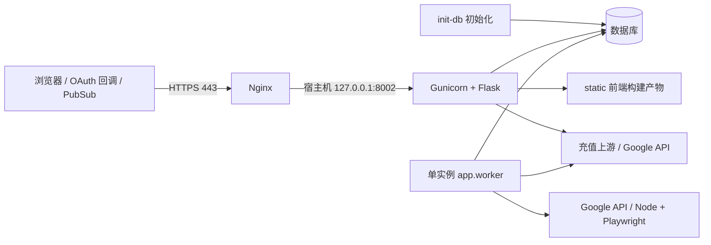

# Google Manager 部署技术说明

适用版本：2026-09-20 整改后的工作区实现。本文面向发布、运维和故障处理人员，说明部署架构、配置约束、升级顺序与验收标准。首次安装和密钥生成步骤见[服务器生产部署指南](server-deployment-guide.md)；最新验收状态见[部署前验收状态](predeployment-status-2026-09-20.md)。本次发布范围已确认仅包含 CDK 工作台，现金支付另行排期。

本文命令使用 **Linux Bash**，默认项目目录为 `/opt/google-manager`。Docker Compose 与 systemd 二选一，避免同时占用 8002 端口或启动两个任务 worker。命令是目标服务器操作步骤，本次文档更新没有执行生产部署。

## 1. 架构与部署边界



| 组件 | 实际入口 | 启动依赖和约束 |
| --- | --- | --- |
| 数据库初始化 | `python -m app.manage init-db` | 必须先于 Web/worker 成功完成；生产不自动建表 |
| Web | `gunicorn -c deploy/gunicorn.conf.py run:app` | 默认 2 个 gthread worker、每个 4 线程；它们不是后台任务 worker |
| 后台任务 | `python -m app.worker` | 单独进程；通过 `instance/worker.lock` 获取文件锁 |
| 入口代理 | `deploy/nginx/google-manager.conf` | 80 跳转到 443；域名、证书路径须按目标环境替换 |

Compose 中 Web 等待 initialize **成功退出**；worker 等待 Web **启动**，不会等待 Web healthy。`/health/ready` 又依赖 worker 心跳，因此不能把后者改为等待 Web healthy，否则会形成启动依赖循环。systemd 的 Web 单元通过 `ExecStartPre` 初始化，worker 单元依赖并排在 Web 单元之后启动。

当前默认方案是单机 SQLite 和单任务 worker，不提供跨主机文件锁或集群调度保证。设置 `DATABASE_URL` 不等于完成数据库驱动、迁移、备份和多机兼容性验收。代码未声明固定的 CPU/内存容量基线，应以真实任务并发和 Playwright 资源占用进行压测。

充值中心提供 CDK 履约与订阅管理；金额输入、支付渠道、支付订单、支付 webhook 和余额账本尚未实现。正式上游鉴权协议未完成验收前，保持 `RECHARGE_MODE=disabled`。

## 2. 工具链与制品

| 项目 | 仓库当前约定 |
| --- | --- |
| Docker 基础环境 | 构建层为 Python 3.11 / Node.js 24 LTS，运行层为 Ubuntu LTS；具体版本与固定 digest 以 Dockerfile 为准 |
| 原生环境 | 安装脚本使用发行版 `python3` 和 `.venv`，未锁定 Python 小版本；脚本面向使用 apt 的系统 |
| Node.js | 使用 Node.js 24 LTS；Dockerfile 与原生安装脚本固定到 24.21.0，部署时核对 `node --version`，后续升级仍需重新做依赖与浏览器验收 |
| Python 依赖 | `requirements.txt`；部署另安装 `gunicorn==23.0.0` |
| 浏览器自动化 | Playwright `1.60.0`，Chromium 安装到 `/ms-playwright`；服务用户必须可读取、执行 |
| 前端 | `npm --prefix frontend ci` 后执行 `npm --prefix frontend run build`，Vite 输出到 `static/` |
| Node 生产依赖 | `npm --prefix googlemail ci --omit=dev`；测试需要开发依赖，不能直接在裁剪后的环境运行 Vitest |

Dockerfile 使用多阶段构建；最终镜像复制 Python 运行时、前端静态资源、Node 可执行文件、Googlemail 生产依赖和 Chromium，不包含 frontend 开发依赖，安装 Python 运行依赖后移除 pip/setuptools/wheel。依赖变化须重建镜像，不在运行容器内安装。`UBUNTU_SECURITY_REFRESH` 用于主动刷新 apt 安全更新层；固定基础 digest 不能冻结 apt 仓库状态，须同时记录最终制品及 SBOM。原生部署使用[安装脚本](../deploy/setup-server.sh)，不会自动 start 业务服务，也不安装 Nginx/Certbot。生产 Compose 无默认镜像、无构建入口；必须通过 `GOOGLE_MANAGER_IMAGE` 指定已验收的镜像 digest，发布记录保留完整提交号、锁文件、扫描报告及镜像 ID。跨发行版复制的语言运行时必须在最终镜像做动态链接、标准库、浏览器和应用验收，不能以构建层测试代替。

`static/index.html` 与带 hash 的 JS/CSS 必须作为同一发布制品更新。不要将 Vite 开发服务器作为生产入口，也不要只替换 HTML 或清除正在使用的资源。源码由 [Vite 配置](../frontend/vite.config.js) 构建，页面和 `/assets/` 由 Flask 提供。

## 3. 配置、网络与持久化

### 3.1 配置来源

生产发布通过 `deploy/compose_release.py` 明确读取候选 `.env`，清除继承覆盖项并检查 Compose 实际值；不得直接用未经清理的 shell 执行启动和迁移。systemd 通过已安装单元的 `EnvironmentFile` 注入。`run.py`、`app.manage`、`app.worker` 的入口还调用 `load_dotenv()`。手动执行维护命令时必须使用相同工作目录、数据库和密钥，不能假定交互 shell 自动继承 systemd 的环境；不要把 `.env` 当作可直接执行的 shell 脚本。

| 配置 | 生产要求 / 影响 |
| --- | --- |
| `FLASK_ENV` | `production`，关闭调试与自动建表，启用 Secure Cookie 和 CSP |
| `ADMIN_PASSWORD` | 至少 16 字符，UTF-8 不超过 4096 字节，无首尾空白，不使用示例密码；轮换后所有实例必须同步重启 |
| `SECRET_KEY` | 至少 32 字节；所有 Web 实例一致，负责签名会话、挑战与任务所有权绑定 |
| `GMAIL_TOKEN_ENCRYPTION_KEY` | 有效 Fernet key；所有 Web/worker 一致，用于 Gmail Token、队列 payload、账号/通知邮箱字段，及派生 CDK 字段 AES-SIV 和账单凭证 HMAC；不可直接换 key |
| `GMAIL_HTTP_TIMEOUT_SECONDS` | Gmail OAuth 与 API 请求的单次网络超时，默认 30 秒；必须配置为正数，避免外部请求无限阻塞业务线程 |
| `DATABASE_BACKUP_ENCRYPTION_KEY` | 独立备份密钥，仅提供给备份/恢复命令；也可用 `--key-file` 指定 0600 密钥文件，不复用业务 Fernet key |
| `GMAIL_CLIENT_SECRET_FILE` | OAuth 客户端 JSON；Compose 固定挂载到 `/app/credentials.json`；原生使用项目绝对路径 |
| `GMAIL_REDIRECT_URI` | 公网 HTTPS 回调，必须与 Google Cloud 登记地址一致 |
| `GMAIL_PUBSUB_TOPIC` / `GMAIL_PUBSUB_VERIFICATION_TOKEN` | 启用 watch/webhook 时配置；Compose 已透传两者 |
| `RECHARGE_MODE` | 默认 `disabled`；生产只允许 `disabled` 或 `live`，拒绝 mock |
| `RECHARGE_UPSTREAM_URL` / `RECHARGE_UPSTREAM_ALLOWED_HOSTS` | live 必须显式配置 HTTPS 上游，不能带 userinfo/query/fragment，主机须命中白名单 |
| `DATABASE_URL` | 未设置时使用项目 `instance/accounts.db`；更改后必须同步维护与备份方案 |
| `TRUSTED_PROXY_CIDRS` | Compose 默认 `172.30.8.1/32`；systemd 模板配置 loopback；仅信任实际代理来源 |
| `GUNICORN_*` | 绑定地址、worker 数、线程数、超时与日志等级，详见 [Gunicorn 配置](../deploy/gunicorn.conf.py) |
| `PROXY` | 可选自动化代理；不是绕过 Google 风控的保证 |

`AUTO_CREATE_DB`、`BACKGROUND_TASK_MODE`、请求体上限和充值限流等是配置类中的代码项，不能通过任意同名环境变量假定覆盖，详见 [app/config.py](../app/config.py)。

轮换 `SECRET_KEY` 会使旧会话/挑战失效，历史客户任务可能需要管理员核验处理。Fernet key 还关联持久化密文和账单身份，不能在普通发布时重新生成；若需轮换，须先停止新操作、用旧密钥对账未决账单，并设计已有密文和身份摘要的迁移。不要删除 `pending/unknown` 记录来绕过门禁。

### 3.2 目录与权限

| 宿主机路径 | Docker 路径 / 处理要求 |
| --- | --- |
| `instance/` | `/app/instance`；SQLite、运行状态与 worker 锁，必须持久化 |
| `googlemail/runtime/` | `/app/googlemail/runtime`；任务运行文件，限制访问 |
| `googlemail/output/` | `/app/googlemail/output`；日志与截图可能含敏感信息，制定受控保留策略 |
| `credentials.json` | `/app/credentials.json:ro`；必须是普通文件，不能误建成目录 |
| `.env` | 不复制进镜像；限制为 0600，并单独安全备份 |

容器以 UID/GID `10001:10001` 运行，绑定目录必须对此用户可写，凭据文件可读。原生服务使用 `googlemanager` 用户，其 UID 不保证等于 10001。不得用放宽到 777 解决目录权限问题。`.dockerignore` 排除密钥、数据库和运行目录；单独保留数据库而丢失原 Fernet key 不能形成可恢复备份。

Compose 首次部署或迁移已有运行目录时，先停止所有写入服务，再执行 `sudo bash deploy/prepare-compose-host.sh`。脚本只准备 `.env`、`credentials.json` 和三个 Compose bind mount 的目录/属主/权限，不创建密钥、不覆盖配置、不删除数据库；`.env` 设为 root:root 0600，后续 `preflight.py` 和受控 Compose 发布入口使用 root 会话。文件系统错误可能部分生效，需保持停服并排错重跑。若初始化失败，先检查 `stat -c '%n %a %u:%g' instance googlemail/runtime googlemail/output credentials.json`。本轮隔离 TLS、Compose 监控和人工配置步骤见 [人工配置手册](production-manual-configuration.md)。

### 3.3 同源访问与安全头

公网仅通过 HTTPS 入口访问；Docker 8002 仅发布到宿主机 loopback，原生 Gunicorn 也默认绑定 loopback。Compose 网段默认 `172.30.8.0/24`，改变网段须核对可信代理地址，不能将整个公网设为可信。

前端 API 地址固定为同源 `/api`，没有需要配置的前端 API 环境变量。写请求携带 `X-Requested-With: XMLHttpRequest`，服务端核验 Origin 与 Fetch 元数据。保留正确的 Host、转发协议和客户端地址；生产会话 Cookie 要求 HTTPS，直接使用 HTTP 登录不能作为有效验收。

production CSP 限制 script/connect 为同源，禁用 object/base；style 允许现有 React 内联样式。额外引入 CDN、跨域 API 或在 HTML 中注入内联脚本前需重新设计策略。当前 `/api/`、`/health/` 响应为 `no-store`，Nginx `/assets/` 缓存 30 天；不得给敏感 API 加公共缓存。

## 4. 初始化与发布顺序

### 4.1 数据库升级检查

`init-db` 先注册模型并创建缺失表，再执行 `app/services/schema_migration.py` 中的版本化增量迁移，以 `schema_migrations` 记录版本并校验必需字段。它补齐 Gmail/billing 租约列、统一账号与 Gmail 连接邮箱的大小写身份，并记录锁定前账号状态以支持正确解锁；保留旧 `pending/unknown` 行与原操作号，并创建管理员会话及人工对账审计表。邮箱规范化发现冲突时会整体回滚，禁止自动合并账号。此实现不是任意数据库版本的自动升级器；仍须在目标库副本验证。

升级必须先停止 Web/worker 并完成加密备份，再迁移结构。账号密码、恢复邮箱、TOTP 及相应历史值新增静态加密；生产拒绝读取这些字段的旧明文，因此还须显式执行 `encrypt-sensitive-data` 盘点、`--apply` 加密，并再次盘点确认计数为 0 后才能启动。若账单摘要曾使用旧算法，须先用旧版本/旧密钥对账；无原凭证不能直接重算摘要。历史任务不会自动补出可信的创建会话所有权，匿名撤回/关闭失败时由管理员核验。

同一命令也迁移充值任务的卡密、账号邮箱和通知邮箱。卡密及账号邮箱使用按字段隔离的确定性 AES-SIV 密文，保留精确等值查询；相同字段内相同值仍可被观察为相等，不能视为隐藏频率，也不能用于 LIKE/范围查询。通知邮箱使用随机 Fernet 密文。此版本没有直接轮换业务根密钥的工具，必须保持所有实例使用同一原密钥。初始化如发现重复上游号、空白/非规范上游号或重复对账证据会停止，必须归档证据并人工核对，禁止删除、合并或自动 trim 存量记录以绕过约束；即使旧库已记录迁移版本，完整校验仍会检查编号语义。局部唯一索引不能代替全表唯一约束。

### 4.2 Docker Compose 发布

先按安装指南准备 `.env`、OAuth 文件和目录权限。首次空数据目录安装可跳过旧库备份。升级时先拉取或构建候选镜像但不要启动，然后停止入口接收新写入和 Web/worker，使用第 6 节的容器内命令完成备份及校验；宿主机不需要 `.venv`。以下初始化命令只在备份验证通过后执行，每一步成功后再执行下一步：

```bash
cd /opt/google-manager
python3 deploy/compose_release.py config --env-file .env --project-root .
python3 deploy/compose_release.py pull --env-file .env --project-root .
read -r -p '独立 GO 审批记录中的 manifest SHA-256: ' approved_manifest_sha256
python3 deploy/compose_release.py init-db --env-file .env --project-root . --approved-manifest-sha256 "$approved_manifest_sha256"
python3 deploy/compose_release.py inventory-encryption --env-file .env --project-root . --approved-manifest-sha256 "$approved_manifest_sha256"
# 仅当上一步计数不为 0，且备份和迁移演练已完成后执行
python3 deploy/compose_release.py apply-encryption --env-file .env --project-root . --approved-manifest-sha256 "$approved_manifest_sha256"
python3 deploy/compose_release.py inventory-encryption --env-file .env --project-root . --approved-manifest-sha256 "$approved_manifest_sha256"
python3 deploy/compose_release.py up --env-file .env --project-root . --approved-manifest-sha256 "$approved_manifest_sha256"
python3 deploy/compose_release.py status --env-file .env --project-root .
```

预期：配置检查退出 0；拉取的镜像摘要与已验收制品一致；初始化输出已应用的迁移版本或结构已是最新版本；加密后盘点 `account_values=0, history_values=0, recharge_task_values=0`；initialize 正常退出，Web 和 worker 运行并通过健康检查。`run --rm` 只移除一次性容器，不删除绑定目录。任一步失败都停止发布。根 Compose 不提供 `build:`；本地构建需显式使用构建命令或 `docker-compose.build.yml`，不得在目标机重新构建未验收制品。

改变 `.env` 后执行 `docker compose up -d --no-build --force-recreate` 让容器重新读取环境；单独 `docker compose restart` 不会重新注入 Compose 环境变量。升级需要在构建环境完成新镜像验收，再拉取该制品，单纯重启不会应用新镜像内容。不要用删除数据目录或 `down -v` 处理升级失败。

### 4.3 Linux systemd 发布

首次执行 `sudo bash deploy/setup-server.sh` 安装依赖并生成单元，然后准备 OAuth 文件和 HTTPS。脚本只 enable 单元，不会自动启动。无论首次安装还是升级，都必须在启动前手动完成 `init-db`、明文盘点、必要的 `--apply` 和二次盘点；Web 单元的 `ExecStartPre` 只能重复执行结构迁移，不能替代存量加密。默认安装路径如下，非默认目录应以已安装单元为准：

原生脚本仅接受 Ubuntu 22.04/24.04、Debian 12 和 x64/arm64，需预装 Python 3.9 以上；Python 虚拟环境应匹配已验收版本。旧 Ubuntu 20.04/Debian 11 及其他系统会在修改系统前被拒绝。浏览器依赖由锁定版本 Playwright 的 `install --with-deps chromium` 按发行版安装，不再硬编码 Ubuntu 24 之前的包名；仍须在实际主机验证。

```bash
cd /opt/google-manager
sudo systemctl daemon-reload
sudo -u googlemanager .venv/bin/python -m app.manage init-db
sudo -u googlemanager .venv/bin/python -m app.manage encrypt-sensitive-data
# 仅当上一步计数不为 0，且可恢复备份已验证后执行
sudo -u googlemanager .venv/bin/python -m app.manage encrypt-sensitive-data --apply
sudo -u googlemanager .venv/bin/python -m app.manage encrypt-sensitive-data
sudo systemctl start google-manager
sudo systemctl start google-manager-worker
sudo systemctl is-active google-manager google-manager-worker
sudo journalctl -u google-manager -u google-manager-worker -n 100 --no-pager
```

Web 的 `ExecStartPre` 初始化失败时不会进入正常服务状态，应先解决日志中的首个错误。修改单元模板后必须同步到 `/etc/systemd/system/` 并 daemon-reload；修改 `.env` 后需在维护窗口重启 Web 和 worker。手动运行 `python -m app.worker --check` 时，使用项目虚拟环境、同一 `.env`/数据库与服务用户，不能用另一个空库的结果判定线上服务。

systemd 原地升级采用固定顺序：在隔离目录准备已验收候选代码但不替换当前运行版本 → 阻断新请求并停止 worker/Web → 使用当前 `.venv` 和候选版本的 `deploy/backup_database.py` 完成加密备份/校验 → 激活候选代码并执行 `setup-server.sh` 更新依赖、前端产物和两个单元 → `daemon-reload` → 手动执行上面的结构迁移与存量加密 → 先启动 Web、再启动 worker 并验收。备份必须早于 `init-db` 和 `encrypt-sensitive-data --apply`；若旧环境没有可运行的 `.venv`，先在隔离发布目录准备依赖并验证备份工具，不得在无可恢复备份时直接迁移生产库。

## 5. 验收与可观测性

```bash
# 本机健康检查，不执行真实业务
curl -fsS http://127.0.0.1:8002/health/ready
# Docker 后台心跳检查：正常退出 0，无须输出正文
docker compose exec -T worker python -m app.worker --check
docker compose logs --tail=100 initialize google-manager worker
```

readiness 正常时 HTTP 200 且 `ready:true`。返回 503 时检查 `worker`、`gmailConfiguration`、`maintenance`、`automation`、`gmailActions`、`rechargeConfiguration` 和 `sensitiveData`；数据库/结构异常可能只有 `ready:false`。探活对 Gmail 必需表列执行零行查询；敏感数据每表最多检查前 20 条，返回 `sensitiveDataSampleLimit:20`，不缓存健康结果。该有界样本能发现错误业务密钥等常见问题，但不能证明样本之外没有损坏数据；上线/恢复验收仍须执行 `python -m app.manage validate-db` 做全量结构/完整性/密文检查。该 CLI 不创建 Flask 应用、不执行迁移，SQLite 以只读连接打开既有文件，成功退出 0，失败退出 1。心跳有效窗口为 30 秒。页面 200、进程 active 或心跳新鲜都不能单独证明第三方业务可用。

Nginx 模板对 `/health/` 默认仅允许 IPv4/IPv6 本机访问，公网请求应返回 403，避免匿名流量触发数据库探活。远程监控通过受控本机采集器执行上述命令；确需远程直接探活时，只在该 location 的 `deny all` 之前加入固定监控源地址，并限制探测频率。不要放行整个公网或未经核验的转发头来源。直接暴露 Gunicorn 或绕过该模板会失去此保护；8002 端口必须保持仅本机/受控内网可达。外部页面存活监控可检查 `/recharge`，但不能将其等同 readiness。

上线前审查受控保存的 `nginx -T` 与实际网络拓扑：如果另一层本机代理将公网流量转发给此 Nginx，请求也会被识别为本机，必须在最外层阻断 `/health/`，或使用独立的环回健康检查监听器；禁止宽泛 `set_real_ip_from` 信任。目标环境应分别验证真实公网请求 403、本机探活 200/503、伪造 `X-Forwarded-For` 仍被拒绝；容量验收同时确认监控实例数及探测周期。

HTTPS 验收前先替换 Nginx 模板域名与证书路径，并执行 `sudo nginx -t`；成功后才 reload。浏览器分别访问实际域名的 `/recharge` 和 `/admin`，检查以下项目：

1. HTML 与 JS/CSS 正常加载，控制台没有 CSP/混合内容错误，刷新页面仍可进入。
2. 管理员登录/退出生效；匿名管理 API 拒绝访问，跨站写请求被拒绝。
3. 默认 disabled 模式配置查询可用，充值业务接口返回 503；live 测试使用另行授权的上游 sandbox。
4. 获授权后验证 OAuth 回调、worker 任务执行/恢复及 Pub/Sub；只在明确允许时使用测试账号和卡密。
5. 验证备份可恢复、两个服务重启后任务状态保留、日志不包含密钥或原始凭证。

Gunicorn 和 Nginx 的日志模板不记录 query string；不得在额外代理或排障命令中输出 OAuth code、Pub/Sub token、Cookie 或请求凭证。Compose 日志单文件上限 20 MB、最多 5 个文件；原生 journald 的保留与磁盘告警由部署方配置。告警至少关注 readiness 503、worker 心跳失效、维护连续失败和未决业务操作积压。

新增 `python -m app.monitor`：探测真实 Web 监听器、数据库、worker 心跳、队列/unknown 积压和实例目录剩余磁盘，输出不含凭据的 JSON，正常退出 0，异常退出 1。默认积压阈值为 300 秒，磁盘阈值为 1024 MiB，可通过命令参数调整；这些是检查默认值，不是已批准的容量/SLO。systemd 可安装并启用 `google-manager-monitor.timer` 每分钟检查。Docker 可在运行的 Web 容器执行 `docker compose exec -T google-manager python -m app.monitor`。检查本身不发送通知，必须由部署方接入告警平台，验证故障触发、接收人和恢复通知；仅有 timer/journal 不代表告警验收通过。

unknown 人工处理接口为 `POST /api/recharge/admin/tasks/<task_no>/reconcile`，必须使用有效管理员会话、同源写请求头和 JSON；它要求归档上游证据，支持“已创建”和“确定未创建”，保留任务与审计记录。同卡处理中的操作或待对账 mutation 不能解锁。不得仅凭本地超时认定未创建，具体请求字段及操作流程见[整改与验收记录](release-remediation-2026-09-20.md)。

## 6. 备份、恢复和回滚

SQLite 备份前关闭业务入口并停止所有写进程；以下停止方式二选一：

```bash
docker compose stop google-manager worker
# 或：sudo systemctl stop google-manager-worker google-manager
```

备份脚本需要独立 Fernet 格式的备份密钥；先由密钥管理系统将 key 安全供应到 0600 文件 `/secure/keys/google-manager-backup.key`，不要复用业务 `GMAIL_TOKEN_ENCRYPTION_KEY`。目标文件必须不存在；外部数据库使用对应数据库的备份工具。

Docker 部署直接使用候选镜像中的 Python 和 `cryptography`，不依赖宿主机 `.venv`。密钥和备份目录必须仅允许容器 UID/GID `10001:10001` 读取/写入：

```bash
cd /opt/google-manager
sudo install -d -m 700 -o 10001 -g 10001 /secure/backups/google-manager /secure/restore/google-manager
sudo chown 10001:10001 /secure/keys/google-manager-backup.key
sudo chmod 600 /secure/keys/google-manager-backup.key
docker compose run --rm --no-deps \
  --volume /secure/keys/google-manager-backup.key:/run/secrets/database-backup-key:ro \
  --volume /secure/backups/google-manager:/backups \
  initialize python deploy/backup_database.py --key-file /run/secrets/database-backup-key \
  backup /app/instance/accounts.db /backups/accounts-before-release.gmbak
docker compose run --rm --no-deps \
  --volume /secure/keys/google-manager-backup.key:/run/secrets/database-backup-key:ro \
  --volume /secure/backups/google-manager:/backups \
  initialize python deploy/backup_database.py --key-file /run/secrets/database-backup-key \
  verify /backups/accounts-before-release.gmbak
docker compose run --rm --no-deps \
  --volume /secure/keys/google-manager-backup.key:/run/secrets/database-backup-key:ro \
  --volume /secure/backups/google-manager:/backups:ro \
  --volume /secure/restore/google-manager:/restore \
  initialize python deploy/backup_database.py --key-file /run/secrets/database-backup-key \
  restore /backups/accounts-before-release.gmbak /restore/accounts.db
```

systemd 部署使用安装脚本创建的项目 `.venv`，并以服务用户运行，避免生成 root 所有的备份文件：

```bash
cd /opt/google-manager
sudo install -d -m 700 -o googlemanager -g googlemanager /secure/backups/google-manager /secure/restore/google-manager
sudo chown googlemanager:googlemanager /secure/keys/google-manager-backup.key
sudo chmod 600 /secure/keys/google-manager-backup.key
sudo -u googlemanager .venv/bin/python deploy/backup_database.py --key-file /secure/keys/google-manager-backup.key \
    backup instance/accounts.db /secure/backups/google-manager/accounts-before-release.gmbak
sudo -u googlemanager .venv/bin/python deploy/backup_database.py --key-file /secure/keys/google-manager-backup.key \
    verify /secure/backups/google-manager/accounts-before-release.gmbak
# 恢复演练使用隔离目录中不存在的新文件，不能覆盖正在运行的数据库
sudo -u googlemanager .venv/bin/python deploy/backup_database.py --key-file /secure/keys/google-manager-backup.key \
    restore /secure/backups/google-manager/accounts-before-release.gmbak /secure/restore/google-manager/accounts.db
```

预期输出“加密备份完成，认证与数据库完整性检查通过”，目标权限为 0600；再次使用相同文件名会拒绝覆盖。校验/恢复同时检查 AES-GCM 认证、大小、SHA-256 和 SQLite 完整性；错误 key 或篡改不能产生可用恢复文件。恢复目录须预先安全创建。旧版两位置参数命令已替换为 `backup/verify/restore` 子命令，旧明文备份仍须隔离管理。另行安全备份 `.env`、OAuth 客户端文件、两类密钥、代码/镜像版本及必要运行产物，密钥与备份分开保管。脚本不备份或撤销外部平台状态。

回滚顺序：停止新写入与两个服务 → 保留故障数据库副本 → 在隔离目录验证备份完整性 → 核对旧代码/schema/原密钥兼容性 → 恢复指定数据库和同版本前后端制品 → 恢复目录属主权限 → 启动并重新验收。恢复数据库会丢失备份后的本地写入，却不会撤销上游已经执行的操作；必须先核对外部结果，禁止直接重放未知充值或账号自动化任务。存在 SQLite WAL 文件时按完整数据库恢复流程处理，不能运行中只覆盖一个 `.db` 文件。

## 7. 常见故障定位

| 现象 | 首先检查 | 处理方向 |
| --- | --- | --- |
| initialize 失败 | 初始化日志、生产密钥校验、目录可写性、表结构 | 解决首个错误后重新初始化；不删除库 |
| Web 运行但 health 503 | readiness 字段和 worker 日志 | 先确认心跳及同一数据库，再查维护失败或凭据可读性 |
| worker 提示锁已占用 | 是否同时运行 Compose/systemd 或第二个 worker | 停止重复进程；进程存活时不能删锁文件绕过 |
| 登录失效、写接口 403 | HTTPS、Host、Origin、转发协议、可信代理范围 | 修正同源访问与代理配置，不关闭权限校验 |
| 静态资源 404/CSP 报错 | HTML 引用的 hash 文件、部署目录、额外注入脚本 | 重新部署完整构建产物并核对缓存策略 |
| Node/Chromium 不可用 | Node 小版本、googlemail 依赖、浏览器路径及执行权限 | 按项目工具链安装，在服务环境验证 |
| Fernet 解密失败或账单身份变化 | 密钥是否被覆盖、实例是否使用同一密钥 | 使用匹配的历史密钥和备份恢复，禁止删未决记录 |
| 撤回/关闭 403 | task_no/卡密/邮箱是否匹配、创建会话是否仍有效 | 历史任务或会话丢失交由管理员核验 |
| live 充值 502/unknown | 上游配置、契约与当前操作记录 | 先查询对账，遵循同意图幂等，不盲目创建反向操作 |

发布评审应保留命令退出码、脱敏日志、代码/镜像版本、schema 核对和恢复演练记录。当前整改证据与未关闭门禁见[整改与验收记录](release-remediation-2026-09-20.md)，不替代 Linux 镜像运行、TLS、真实 Google 服务、充值上游及告警送达的目标环境验收。
