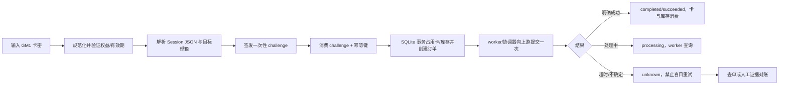
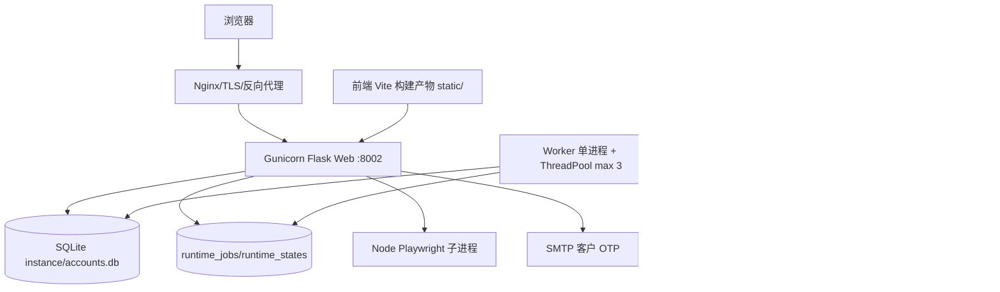

# Google Manager 全项目架构、产品与 UI/UX 审计及改进规划

审计日期：2026-09-26  
审计基线：当前工作区（不是单一提交；工作树存在未提交改动）  
审计视角：项目负责人、系统架构师、产品经理、UI/UX 设计师、测试与发布负责人

## 1. 执行结论

当前项目已经形成三个相互关联但边界不同的产品域：

1. **Google 邮箱资产管理**：账号库、2FA、Gmail OAuth/收件箱、批量自动化、安全防盗与验证码聚合。
2. **CDK 卡密履约工作台**：供应商库存、平台卡密发行、双人审批、分发、客户领取、核销、对账和审计。
3. **旧充值/订阅兼容链路**：历史供应商卡密任务查询、撤回/关闭、账单与订阅操作。

代码、测试和部署工具已经覆盖了大量关键控制：服务端会话吊销、敏感字段加密、挑战令牌、幂等键、unknown 状态、人工对账、CDK 四眼审批、SQLite 事务锁、容器非 root、固定运行时与恢复工具。这些能力使项目适合继续进行隔离环境验收。

**当前结论是“隔离验收可继续，正式生产仍 NO-GO”。** 原因不是单元测试不足，而是发布证据链和外部依赖尚未闭合：当前工作树不干净；真实 Google OAuth/Gmail/Pub/Sub、真实充值上游鉴权和幂等、目标 Linux 制品/漏洞门禁、正式 TLS/反代、容量 SLO、告警送达、正式库迁移恢复与 RPO/RTO 仍需实证。`RECHARGE_MODE` 在未完成这些验收前必须保持 `disabled`。

本机当前可复现的检查结果：

- Python 全量回归：500 项通过，17 项跳过，退出码 0；仍有 `datetime.utcnow()` 弃用提示和 SQLite `ResourceWarning`。
- Googlemail Vitest：8 个测试文件、71 项通过。
- 前端生产构建：`npm --prefix frontend run build` 通过。
- 共享 Node 回归：41 项通过。
- 前端/充值/CDK 浏览器链路：60 项通过。
- 原始 `git diff --check`：因当前改动文件的 CRLF 行尾被报告为 trailing whitespace；应使用项目约定的 `cr-at-eol` 规则或在形成候选提交前统一处理，不能把此结果当作干净候选证据。

## 2. 审计范围、证据和假设

### 2.1 已核对内容

- 根规则、`README.md`、`googlemail/AGENTS.md`、部署与发布文档。
- Flask 应用工厂、配置、四个 Blueprint、服务层、模型、worker、monitor、迁移和备份工具。
- React/Vite/Tailwind 前端入口、所有主要页面、API 封装和 CDK 客户端。
- Node/Playwright 子项目、测试入口、Docker Compose、Dockerfile、Nginx、systemd 与 GitHub Actions。
- 现有发布审查、充值审计、CDK 产品方案、服务器验收记录。

### 2.2 不能从仓库直接确认的内容

以下内容不应根据本地 mock、合成上游或文档占位值推断：

- 真实生产 `.env`、凭据、Google Cloud OAuth 客户端、Pub/Sub topic 和 SMTP 投递结果。
- 充值供应商的正式 API 鉴权、幂等、撤回/关闭和 unknown 语义。
- 目标服务器的真实域名、证书、Nginx 拓扑、容量、磁盘、告警接收人和值班安排。
- 正式数据库的数据规模、存量明文/重复数据、RPO/RTO 和异地备份。
- 目标用户设备占比、业务 SLA、客户身份归属和各员工角色的组织授权。

### 2.3 当前工作树状态

工作树存在约 113 个变更条目，其中包含核心后端、前端、部署、文档、测试和新 CDK 文件。CI 的 release gate 会拒绝 dirty worktree；因此当前目录只能作为审计和隔离验收基线，不能直接作为发布候选。

## 3. 项目目标与业务边界

### 3.1 已确认目标

| 目标 | 当前实现 | 业务价值 |
| --- | --- | --- |
| Google 账号资产管理 | 账号导入、查询、编辑、状态/出售状态、2FA、导出、历史 | 降低人工维护成本，集中管理账号资产 |
| Gmail 集中操作 | OAuth、收件箱、标签/归档、规则、Pub/Sub、守护同步 | 减少逐个登录邮箱的操作成本 |
| 批量自动化 | Playwright 2FA/OAuth 任务、进度、取消、失败记录 | 提高批处理效率，支持无人值守任务 |
| 安全防盗 | 转发/过滤规则扫描、OTP 聚合、风险评分、锁定/解锁 | 尽早发现邮箱被接管或验证码外泄 |
| CDK 履约 | 供应商库存到平台卡密、审批、分发、兑换、对账 | 形成可追踪的权益交付闭环 |
| 旧链路兼容 | 历史任务查询、撤回/关闭、账单订阅工具 | 保护已有订单数据和运营流程 |

### 3.2 必须明确的非目标

当前没有现金支付、支付回调、钱包余额、资金账本、会员权益结算、优惠活动、财务对账系统。充值页面中的参考面额或上游账单金额不能对外表述为本平台收款或余额。若未来要支持现金支付，应建立独立支付域，不应把金额字段塞入现有 `recharge_tasks` 或 Google 账号模型。

### 3.3 产品边界原则

- Google 邮箱账号是**资产主体**，购买人/客户是**客户主体**，CDK 是**权益凭证**，上游履约订单是**外部副作用记录**，四者不能互相替代。
- 旧充值链路和 CDK 链路可以暂时共存，但必须通过入口、状态、数据表、权限和文案明确区分。
- “已提交”“已受理”“处理中”“已完成”“待核对”分别代表不同事实，页面不能用统一的“充值成功”覆盖。

## 4. 用户角色与权限体系

### 4.1 当前角色

| 角色 | 当前入口 | 可执行动作 | 主要风险/问题 |
| --- | --- | --- | --- |
| 匿名客户 | `/`、`/recharge` | 验证 CDK、填写 Session JSON/邮箱、提交兑换、查询本人记录 | 会话丢失后只能查询公开状态；客户身份与目标邮箱的业务归属仍需产品确认 |
| 已验证 CDK 客户 | CdkPortal 邮箱 OTP | 领取票据、查看本人卡密/核销记录、找回请求结果 | SMTP 未验收时必须关闭指定客户能力 |
| CDK `admin` | `/admin` | 全部 CDK 能力、员工与客户管理、审批和对账 | 权限过大，需组织上明确双人职责与渠道范围 |
| CDK `operator` | `/admin` | 目录、库存、发行、控制、分发、导出 | 不应查看不必要的完整卡密或跨渠道数据 |
| CDK `reviewer` | `/admin` | 审批、对账、审计读取 | 需确保申请人和复核人不是同一人 |
| CDK `support` | `/admin` | 只读查询 | 需要清晰展示“无权操作”的原因和申请路径 |
| CDK `auditor` | `/admin` | 只读与审计 | 审计数据需要外部归档，SQLite 文件自身不可防篡改 |
| 旧充值管理员 | `/admin?tab=orders` | 共享管理员会话下查看/刷新/撤回/关闭/人工对账旧任务 | 与具名 CDK 员工是两套身份，当前命名容易混淆 |
| Googlemail 管理员/运营员 | `/Googlemail` | 账号库、Gmail、批量自动化、安全中心 | 仍主要依赖共享管理员密码；与 CDK 员工权限没有统一 IAM |
| worker/system | Docker `worker` 或 systemd worker | 消费队列、Gmail 同步、未知任务查单、CDK outbox/维护 | 单机单 worker、SQLite 文件锁，无法直接水平扩展 |
| 外部依赖 | Google、供应商、SMTP、Nginx | 提供授权、邮件、履约、反向代理 | 真实协议和可用性尚未完成目标环境验收 |

### 4.2 推荐的权限矩阵

把权限拆成“领域 × 动作 × 数据范围 × 风险级别”，由后端强制执行，前端只负责解释：

| 领域 | 读取 | 低风险写入 | 高风险写入 | 审批/对账 |
| --- | --- | --- | --- | --- |
| 账号资产 | 账号摘要、状态 | 备注、导入、出售标记 | 删除、解锁、凭证变更、敏感导出 | 安全管理员复核 |
| Gmail | 连接和邮件摘要 | 标记已读、归档、标签 | 规则执行、转发处置 | 规则确认人 |
| Googlemail 自动化 | 任务状态 | 创建/取消任务 | 代理、恢复邮箱池、批量执行 | 任务负责人 |
| CDK 目录/库存 | 脱敏库存、权益、渠道 | 导入、验证 | 作废、冻结、延期、补发 | reviewer |
| CDK 分发/导出 | 分发摘要 | 生成领取票据 | 完整卡密导出 | 独立审批人 |
| CDK 核销/对账 | 订单与状态 | 刷新/查单 | 释放/人工结案 | reviewer + 证据 |
| 旧充值任务 | 脱敏任务 | 刷新 | 撤回、关闭、unknown 结案 | 管理员 + 审计 |

## 5. 当前端到端业务场景

### 5.1 CDK 客户兑换（当前主路径）



当前已经有挑战、幂等、占用、unknown、查单和人工对账控制；真实上游是否按约定兑现 `client_task_no/idempotency_key` 仍待 sandbox 验收。

### 5.2 Google 账号运营

导入/单录 → 格式校验与去重 → 账号列表搜索/筛选 → 查看脱敏摘要 → 按权限复制或编辑 → 2FA/历史 → 批量标记/导出 → 安全中心锁定或 Googlemail 自动化。

当前页面把账号列表、导入、Googlemail、Gmail 收件箱、统计和安全中心放在同一内存 `view` 状态中，刷新和浏览器后退无法恢复子页面。

### 5.3 Gmail OAuth 与收件箱

管理会话 → OAuth start → Google 回调 state 校验 → Token 加密落库 → 连接列表 → 邮件分页/搜索 → 读取/归档/标签 → 规则/人工确认 → 守护同步或 Pub/Sub。

目前 Pub/Sub、真实 OAuth、Token refresh、撤销授权、watch 续期都需要授权账号实测。

### 5.4 CDK 发行与运营

配置渠道/权益 → 导入供应商原码 → 预览与验证 → 创建 1–100 张批次 → 生成 GM1 → maker 申请审批 → reviewer 激活 → 分发/领取票据或受控导出 → 用户兑换 → 核销订单 → 对账、审计、库存终结。

当前同步批次上限为 100，尚未实现 5000 行异步分块、多供应商路由、活动配额和财务日报。

## 6. 当前技术架构与运行方式

### 6.1 运行拓扑



Docker Compose 当前包含 `initialize`、`google-manager`、`worker` 三个服务，共享 SQLite、runtime/output 和 credentials bind mount；Web 只绑定宿主机 loopback 8002。原生 systemd 方案由 Web、worker 和 monitor timer 组成。

`worker` 只依赖 Web 的 `service_started`，而 Web readiness 又依赖 worker 心跳；这是为避免互相等待而采用的启动顺序，部署验收必须验证短暂启动窗口、重启恢复和 readiness 最终收敛，不能简单把依赖条件改成 `service_healthy`。

### 6.2 技术栈

| 层 | 当前技术 | 事实与限制 |
| --- | --- | --- |
| Web 后端 | Python 3.11 目标运行时、Flask 3.1、SQLAlchemy 2.0、Gunicorn | 生产路径以 WSGI + gthread 为主 |
| 数据库 | SQLite 默认、手工版本迁移 | CDK 写事务明确依赖 SQLite；外部 PostgreSQL/MySQL 未完成驱动/备份/恢复验收 |
| 前端 | React 18、Vite 6、Tailwind 3、Lucide | 无 React Router、无 TypeScript、无独立 lint/typecheck |
| 自动化 | Node ESM、Playwright 1.63、otplib 13 | Google 真实流程需授权账号验收；浏览器产物与 sandbox 是发布依赖 |
| 队列 | 数据库任务表 + 单 worker 文件锁 | 不是通用消息队列或跨主机调度 |
| 部署 | Docker 多阶段、Compose、systemd、Nginx | 固定镜像 digest/manifest 与正式发布证据尚未形成 |
| 监控 | readiness、monitor、journal、容器日志轮转 | 无指标后端、集中检索和告警送达闭环 |

### 6.3 代码结构评估

当前目录职责基本可读，但业务复杂度已经超过单体文件的舒适范围：

- `app/routes/` 已按 API 域拆分，但鉴权、输入校验、错误映射仍散落在路由和服务中。
- `app/services/` 同时承载领域规则、外部适配、事务、状态机和序列化；`recharge_service.py`、`googlemail_service.py` 已较大。
- `frontend/src/components/RechargeView.jsx` 约 1884 行，`GmailInboxView.jsx` 约 885 行，`AccountListView.jsx` 约 598 行；组件内同时包含数据获取、轮询、表单校验、状态机和展示。
- `frontend/src/App.jsx` 通过 pathname 手工分流，内部模块使用 `setView`；缺少可分享的领域路由和统一布局壳。
- `static/` 是构建产物，当前存在旧 hash 删除、新 hash 未跟踪的状态，必须在发布候选中统一生成和核对。

### 6.4 外部服务依赖

| 依赖 | 用途 | 当前耦合点 | 需要的生产证据 |
| --- | --- | --- | --- |
| Google OAuth/Gmail API | 授权、邮件、规则、watch、Token refresh | `GmailService`、Pub/Sub webhook、加密 Token | OAuth 回调、scope、撤销、refresh、watch 续期和重复通知验收 |
| 充值供应商 HTTPS | 卡密验证、履约、查单、撤回/关闭、订阅 | `RechargeService` adapter | 版本化契约、服务间鉴权、幂等、超时、unknown 和证据 |
| SMTP over TLS | CDK 客户 OTP | `cdk_identity` | 投递、退信、限额、证书、凭据轮换和失败恢复 |
| Chromium/Playwright | Googlemail 账号自动化和 OAuth | Node 子进程、固定浏览器产物、seccomp | 目标 Linux 启动、sandbox、权限、容量、取消/崩溃恢复 |
| Nginx/TLS/代理 | HTTPS、Cookie、健康端点和公网入口 | trusted proxy、Secure Cookie、Host/redirect | 真实 `nginx -T`、域名证书、未知 Host、XFF、续期和公网 smoke |
| 文件系统/备份 | SQLite、runtime、output、credentials、密钥 | bind mount 与 UID 10001 | 权限、磁盘、加密备份、异地复制、恢复耗时 |

## 7. 数据模型与状态管理

### 7.1 数据域

| 数据域 | 主要表/模型 | 当前用途 | 关键注意点 |
| --- | --- | --- | --- |
| 账号资产 | `accounts`、`account_history` | 邮箱、密码、恢复邮箱、TOTP、出售状态、修改历史 | 字段使用 Fernet；历史读取仍需严格权限和审计 |
| Gmail | `gmail_connections`、`gmail_rules`、`gmail_task_logs`、`gmail_executions`、`gmail_watch` | Token、规则、动作日志、watch 租约 | 外部 API 失败要可重试且不重复执行 |
| Googlemail 自动化 | `googlemail_tasks`、`runtime_jobs`、`runtime_states` | Playwright 任务、队列快照、取消/心跳 | failed 任务的 active key 释放与人工解决入口需补齐 |
| 旧充值 | `recharge_tasks`、`recharge_operations`、`recharge_billing_mutations`、对账表 | 上游任务、unknown、订阅变更 | 不是资金账本；必须保留外部副作用证据 |
| CDK | 18 张 `cdk_*` 表 | 员工、客户、渠道、权益、批次、卡、库存、审批、分发、核销、审计、outbox | 当前 SQLite、小批量、单供应商；密钥轮换需保留旧 key |
| 安全/限流 | `request_limit`、登录尝试/封禁、管理员会话 | IP、卡密、凭证限流和会话吊销 | 多实例时仍依赖同一数据库，容量需实测 |

### 7.2 推荐的状态机规范

#### CDK 卡密/库存/核销

- 卡控制：`draft → active → frozen → active`；`draft/frozen → void`。
- 卡使用：`unused → reserved → redeemed`；只有明确 `released/cancelled` 才释放占用。
- 核销：`prepared → dispatching → processing → succeeded`，异常进入 `unknown`，通过证据进入 `released` 或明确完成。
- 库存：`quarantine → available → allocated → reserved → consumed`，验证失败进入 `unusable`。

#### 旧充值任务

`pending → processing → completed/failed/recalled/closed`；网络不确定进入 `unknown`。unknown 只能通过查单或人工证据解决，不能以浏览器重试替代对账。

#### 运行任务

建议统一 `queued → running → succeeded/failed/cancel_requested/cancelled → needs_review`，对 `active_key`、重试次数、最后错误、人工解决人和解决时间建立明确字段与审计事件。

### 7.3 当前数据与状态缺口

- `RuntimeState` 和进程内 `gmail_sync_daemon.status()` 可能表达不同事实，重启/多进程时 UI 状态可能漂移。
- worker 维护 Gmail 全量连接串行同步，缺少每邮箱预算、游标和 backpressure。
- 监控对 `status + time` 的联合查询没有统一复合索引，数据增长后 readiness/monitor 可能退化为扫描。
- `recharge` 和 `cdk` 订单分属不同模型，旧后台和新工作台需要统一“订单关联视图”，但不能强行合并历史含义。

## 8. 接口与服务依赖评估

### 8.1 当前接口分组

- 管理认证：`/api/auth/login|logout|check`。
- 账号资产：`/api/accounts*`、`/api/stats`、`/api/accounts/export`。
- Googlemail 自动化：`/api/googlemail/tasks*`。
- Gmail：`/api/gmail/oauth/*`、连接/消息/标签/规则/task logs/watch/webhook。
- 安全中心：`/api/security/*`。
- 旧充值：`/api/recharge/config|agreement|redeem-codes|submission-challenges|tasks|billing|admin/*`。
- CDK：`/api/cdk/config|customer/*|admin/*|validate|challenges|redemptions|claims|cards/mine`。

### 8.2 已有接口优点

- 普通 API 和充值 API 基本采用 `{success, data, message}`；充值错误增加 `error_code`。
- 写请求有同源、`X-Requested-With`、JSON、CSRF/Origin 检查。
- CDK 使用 `Idempotency-Key`、版本号、能力与渠道范围；旧充值用挑战 token、任务所有权和 unknown 对账。
- 上游 HTTP 有 HTTPS/主机白名单、超时、响应体限制和禁止重定向。

### 8.3 接口层需要补齐

1. 发布版本和 OpenAPI 契约缺失。建议每个领域维护 `/api/v1/...` 版本前缀、错误码表、幂等语义、状态码和示例。
2. 统一错误结构，至少包含 `code`、`message`、`request_id`、`retryable`、`next_action`，避免前端只能解析中文 message。
3. 统一分页、排序、筛选和时间格式；所有时间以 UTC ISO 8601 返回，界面按用户时区显示。
4. 统一审计事件：actor、role、scope、request_id、resource、before/after 摘要、外部 operation_id、证据摘要。
5. 对外部供应商建立 Adapter 契约测试：鉴权、幂等、超时、查询、撤回、关闭、重复响应、乱序响应、签名和证书校验。

## 9. 现状问题清单与改进建议

### 9.1 必须立即处理（P0/P1，开放正式生产或扩大业务前关闭）

| 问题 | 具体表现与原因 | 业务/技术影响 | 建议与成本 |
| --- | --- | --- | --- |
| 范围和入口语义冲突 | `/` 默认 CDK，`?service=legacy` 才是旧链路；`/admin` 是 CDK 员工，`/admin?tab=orders` 是旧管理员；README 仍有旧描述 | 客服、运营和发布人员可能进入错误系统；权限边界难以解释 | 统一产品命名、入口和兼容重定向；保留 legacy 期限和下线日期。成本：中 |
| 发布基线不固定 | 工作树约 113 项变更；CI 要求 clean commit；静态 hash 文件混杂 | 无法证明镜像、文档、前端产物属于同一版本 | 形成候选分支/提交、锁定 static、生成 manifest、SBOM、扫描和回滚包。成本：中 |
| 真实依赖未验收 | Google OAuth/PubSub、SMTP、供应商 live、正式 TLS/容量/告警均无目标证据 | 运行成功不代表可履约；unknown 可能长期堆积 | 建立外部依赖验收矩阵；live 前保持 disabled。成本：高（跨团队） |
| 敏感凭证的 UI 暴露面过大 | 账号编辑表单把密码/TOTP 放入可见输入；列表可复制完整组合；Session JSON/代理等敏感输入散落各页 | 内部误复制、截图、肩窥或浏览器自动填充造成接管风险 | 统一 `SecretField`：默认掩码、短时 reveal、复制后清除、禁止日志和审计；导出需角色/审批。成本：中 |
| 管理身份模型分裂 | Googlemail/旧订单共享管理员会话，CDK 为具名员工；两者前端导航相邻但缺少清晰解释 | 最小权限和责任追踪不足，离职/轮岗难处理 | 近期保留隔离但补权限矩阵和审计 actor；中期统一 IAM/SSO，按领域授权。成本：中到高 |
| 自动化失败锁未闭环 | failed 任务可能保留 `active_key`；取消接口不能完成受审计释放 | 后续自动化任务被永久阻断，需要 DBA/脚本介入 | 增加 `needs_review`、人工 resolve/release 接口、双人确认和审计。成本：中 |
| 告警闭环缺失 | monitor 只有退出码/journal；无指标后端、通知渠道、恢复告警和值班责任 | worker/unknown/磁盘/5xx 故障可能无人知晓 | 接入指标与告警路由，演练故障+恢复；定义阈值、负责人和升级时间。成本：中 |
| 生产镜像/漏洞门禁未闭合 | 历史扫描仍有 OS HIGH/CRITICAL；正式 digest、远端 registry 和 GO 尚未形成 | 供应链风险和发布可追溯性不足 | 针对最终镜像修复/替代基础层，重跑 Linux smoke、SBOM、扫描和许可证清单。成本：中 |
| 数据迁移/恢复未以目标库验收 | 本地工具和合成副本通过，正式库数据量、密钥托管、RPO/RTO 未确认 | 回滚可能丢失数据或无法解密；数据库恢复不撤销外部副作用 | 停写备份→副本迁移→全量校验→恢复演练→外部副作用对账。成本：高 |

### 9.2 近期优化（P1/P2，影响效率、可维护性和误操作率）

| 问题 | 具体表现与原因 | 影响 | 建议与成本 |
| --- | --- | --- | --- |
| 前端巨型组件 | `RechargeView`、`GmailInboxView`、`AccountListView` 同时承载请求、状态机、表单和展示 | 变更回归范围大，难以复用和测试 | 按领域拆 `api/hooks/state/view`；先拆轮询、表单、状态时间线。成本：中 |
| 无真正子路由 | AdminApp 用 `setView`，刷新/后退/深链失效 | 客服无法分享链接，任务中断后恢复困难 | 使用 React Router 或 query/hash 最小路由；增加路由守卫和旧链接重定向。成本：中 |
| 双充值域重复 | legacy 与 CDK 既有接口、状态、后台、文案重复 | 运营培训、报表和客服判断复杂 | 以 CDK 为主域，legacy 进入迁移模式；建立统一订单查询投影。成本：中 |
| UI 设计系统不统一 | Googlemail 蓝靛、充值 emerald、CDK utility 白底；按钮、圆角、状态色各自定义 | 视觉认知不一致，跨模块学习成本高 | 建立 token、Shell、Button、Panel、StatusChip、Dialog、Toast、Table 组件。成本：中 |
| 移动端信息密度过高 | 账号/CDK/订单表在窄屏主要靠横向滚动 | 手机用户难以完成主任务，误触率高 | `<768px` 使用卡片/详情抽屉，固定主操作栏；表格保留 3–5 个关键列。成本：中 |
| 可访问性不完整 | modal 缺 `role=dialog/aria-modal`、焦点陷阱和恢复；toast 无 `aria-live`；tab/table 语义不完整；大量 `window.confirm` | 键盘/读屏用户无法可靠完成敏感操作 | 统一 Dialog/Tabs/Toast/Field，补 axe、键盘、缩放、减少动画测试。成本：中 |
| 错误反馈不一致 | 部分 catch 仅 console 或静默；3 秒 toast 易消失；字段级错误不足 | 用户不知道是否成功，可能重复提交 | 统一 inline error、可重试、request/task id、下一步行动；保留失败上下文。成本：低到中 |
| 状态反馈未形成统一时间线 | Googlemail、Gmail、旧充值、CDK 轮询频率和终态文案不一致 | 用户难以判断“等待、重试、联系谁” | 建立统一状态词典、允许动作表和时间线组件。成本：中 |
| 监控查询与同步缺预算 | Gmail 全量连接串行；监控按状态/时间扫描；无 per-mailbox budget | 连接数和历史数据增长后 worker 延迟、readiness 变慢 | 加游标、批次、并发上限、复合索引和保留归档；压测后定值。成本：中 |
| 子进程错误上下文不足 | Node stdout 大多丢弃或只记录固定“运行中” | 真实自动化失败难定位 | 保留脱敏错误码、最后 N 行、task/job/request 关联；敏感清理失败单独告警。成本：低到中 |
| 本地入口不统一 | 根目录有无对应 `package.json` 的孤立 `package-lock.json`；命令必须分别使用 `--prefix frontend/googlemail` | 新成员容易在根目录执行错误命令，CI 与本地验证不一致 | 增加根级 PowerShell/Make 任务入口，或删除并说明孤立锁文件；把 Python、前端、Node、浏览器回归组成一套 matrix。成本：低 |

### 9.3 长期规划（P2）

- PostgreSQL/外部队列/对象存储和多实例 HA：仅在有容量证据、RPO/RTO 和组织预算后实施。
- 统一 IAM/SSO、租户和渠道策略；保留领域级最小权限。
- 事件总线、通知中心、WebSocket/SSE 任务中心；当前轮询先通过预算和退避控制。
- CDK 多供应商、异步大批量、活动配额、会员/钱包/支付/财务账本（独立产品和会计评审）。
- 完整 OpenTelemetry、集中日志、审计不可变归档、多语言与时区策略。

## 10. 目标信息架构与页面清单

### 10.1 公共客户壳 `/recharge`

1. **兑换**：卡密验证 → 凭证/目标邮箱 → 最终确认 → 结果时间线。
2. **订单与卡密查询**：单条/批量查询、状态筛选、请求编号找回。
3. **订阅工具**：仅在 legacy 保留期展示，明确“外部订阅工具，不是平台支付”。
4. **服务协议与教程**：输入格式、隐私提示、失败后的操作、不要重复提交。
5. **我的卡密**：已验证客户登录、领取记录、脱敏卡密和核销状态。

旧入口 `/recharge?service=legacy` 保留兼容，但页面必须标记“旧版/迁移中”，并有迁移说明和客服路径。

### 10.2 运营壳 `/ops`（建议未来从 `/Googlemail` 演进）

1. 概览：库存、任务、风险待办、worker/同步健康。
2. 账号库：服务端分页/搜索、卡片化移动视图、详情与历史。
3. 导入向导：格式说明 → 预解析 → 逐行错误 → 预览 → 确认。
4. Googlemail 任务中心：配置 → 影响预览 → 确认 → 进度 → 失败重试/导出。
5. Gmail：连接、收件箱、规则、守护中控、同步历史。
6. 安全中心：OTP、转发/过滤规则、风险账号、锁定/解锁、处置审计。
7. 审计：按 actor、资源、时间、request id、结果筛选。

### 10.3 CDK 员工壳 `/cdk-admin`

1. 概览
2. 渠道与权益
3. 供应商库存隔离/验证
4. 批次与卡密
5. 分发与领取
6. 审批（maker/checker）
7. 核销与人工对账
8. 导入/导出作业
9. 员工与客户
10. 操作审计

页面展示“当前角色、渠道范围、可执行动作、需要谁审批”，无权模块可显示只读或申请权限的原因。

### 10.4 旧订单后台 `/recharge-admin`

总览 → 订单列表 → 详情抽屉 → 刷新/撤回/关闭 → unknown 对账向导。默认隐藏完整卡密和凭证；证据字段采用结构化表单，明确 `operation_id`、证据来源、SHA-256、观察时间和下一步。

## 11. 端到端用户动线与交互规则

### 11.1 客户兑换

1. 输入卡密，前端只做格式校验，服务端返回权益名称、有效期、是否支持续费和当前模式。
2. 粘贴 Session JSON，解析后只显示目标邮箱和套餐摘要；原文默认遮罩，禁止写入 localStorage。
3. 要求用户再次确认目标邮箱、协议和“消费一份权益”；对不支持续费的卡清空并禁用续费选择。
4. 提交前显示摘要、预计状态、不可逆说明和“不要重复提交”。提交按钮进入幂等锁。
5. 成功显示任务号、请求编号、状态时间线和下一步；网络超时显示“请先找回结果”，不能直接再次创建。
6. `unknown` 显示“待核对，请勿重复下单”，说明谁处理、预计 SLA、何时联系客服。
7. 撤回/关闭使用可访问确认对话框，明确是否释放卡密、是否需要上游证据、是否可撤销。

### 11.2 账号运营

概览风险待办 → 导入向导 → 账号列表 → 详情抽屉 → 2FA 临时码/历史 → 批量操作 → 任务中心。敏感字段按角色显示；复制后 toast 必须可读、短时、可撤销/清除。

### 11.3 批量自动化

选账号 → 显示影响数量 → 配置无头、延迟、代理、恢复邮箱池并解释风险 → 最终摘要 → 确认 → 当前账号/完成/失败/待复核 → 取消语义 → 失败项重试或导出。取消后必须显示“已请求取消/正在停止/已停止”的真实状态。

### 11.4 Gmail

连接状态卡 → OAuth 向导 → 收件箱列表/详情双栏 → 规则 dry-run → 人工确认 → 守护开关与轮询间隔 → 最近同步/错误 → 安全中心联动。移动端详情使用底部抽屉，避免长表横向滚动。

### 11.5 统一状态反馈矩阵

| 状态 | 页面表现 | 用户可执行动作 | 设计约束 |
| --- | --- | --- | --- |
| 首次加载 | 骨架屏或局部 spinner，保留页面标题和上下文 | 取消可取消的请求；不重复点击 | 不用空白页或仅显示“加载中” |
| 刷新中 | 旧数据保留，标题旁显示更新时间/刷新中 | 继续查看；必要时取消刷新 | 防止旧数据被误认为最新，显示数据时间 |
| 空状态 | 说明“没有数据”的原因（未连接、筛选无结果、尚未创建） | 提供唯一主 CTA，如“连接 Gmail”“导入账号” | 空状态不能只写“暂无记录” |
| 字段错误 | 字段下方显示可行动的错误和格式示例 | 修正字段后即时重新校验 | 错误与字段关联，不能只用顶部 toast |
| 网络/服务错误 | 显示错误类型、request id、是否可重试 | 重试、查看任务、联系客服/转人工 | 不泄露上游响应、凭证或堆栈 |
| 权限不足 | 说明当前角色/渠道范围和所需能力 | 申请权限、切换账号或只读查看 | 前端隐藏不能替代后端拒绝；重要模块显示原因 |
| 部分成功 | 显示总数、成功、失败、待复核和失败行 | 下载失败清单、重试失败项 | 批量导入/授权不能只显示一个“成功” |
| 不确定/unknown | 琥珀色“待核对”，保留任务号和开始时间 | 查单、提交证据、联系指定负责人 | 禁止出现“再次提交”作为默认按钮 |
| 成功 | 显示业务结果、任务/订单号、完成时间 | 查看详情、复制脱敏编号、开始下一笔 | 成功提示要能被读屏读取，并保留可追踪编号 |
| 破坏性操作确认 | 弹窗列出对象、影响、是否可撤销、审批人 | 确认、取消；必要时二次输入对象名 | `window.confirm` 替换为可访问 Dialog |
| 可撤销窗口 | 操作后显示短时撤销或“正在处理”状态 | 撤销、查看进度 | 只有服务端支持逆操作时才显示撤销 |

## 12. UI 设计系统建议

### 12.1 视觉方向

采用“运营控制台 + 客户任务向导”的双壳设计：

- 客户端：浅色、低密度、强调绿色成功与琥珀警告，突出当前步骤和下一步。
- 运营端：中性灰背景、蓝色主导航、红/琥珀仅用于风险和阻断，减少渐变和过度圆角。
- 高风险操作：使用明确的状态标签、影响范围、审批人和审计链接，不依赖颜色。

### 12.2 Token 和组件

| 类别 | 推荐基线 |
| --- | --- |
| 间距 | 4/8 基数，页面内主要间距 16/24/32 |
| 圆角 | 控件 8，卡片 12，弹窗 16；不要每个模块自定义 2xl/3xl |
| 字体 | 中文系统无衬线；正文 14–16px，标题 20–28px，敏感码使用等宽字体 |
| 控件高度 | 桌面 36/40，移动主操作至少 44 |
| 颜色 | primary、success、warning、danger、info、neutral 语义 token；每个状态同时有文字/图标 |
| Focus | 2px 高对比 focus ring；键盘顺序与鼠标一致 |
| 组件 | `AppShell`、`TopNav`、`PageHeader`、`FilterBar`、`DataTable/CardList`、`StatusChip`、`SecretField`、`Dialog`、`Toast`、`Timeline`、`EmptyState`、`ErrorState`、`Skeleton` |

### 12.3 无障碍与响应式验收

- ≥1280px：桌面双栏/表格；768–1279px：保留表格但固定关键列；<768px：卡片、详情抽屉、底部 sticky 主操作。
- 所有弹窗具 `role=dialog`、`aria-modal`、`aria-labelledby`、ESC 关闭、焦点陷阱和返回焦点。
- Tabs 使用 `role=tablist/tab`、`aria-selected` 和箭头键；table header 使用 `scope`。
- 加载、错误、成功、轮询状态使用 `aria-live`；toast 不作为唯一反馈。
- 文本对比度达到 WCAG AA；动画支持 `prefers-reduced-motion`。
- 视觉回归至少覆盖 375px、768px、1280px、1600px，且验证无横向溢出和键盘可达。

## 13. 推荐目标架构

### 13.1 后端分层

```text
app/
  api/                 # 版本化路由、请求/响应 DTO、错误码
  domains/
    identity/          # 管理员、CDK staff、客户会话与 RBAC
    account/           # Google 账号资产、历史、导入导出
    gmail/             # OAuth、消息、规则、watch、同步
    automation/        # Googlemail/Playwright 任务与运行状态
    cdk/               # 目录、库存、批次、卡密、分发、核销、对账
    legacy_recharge/   # 旧供应商任务和订阅兼容层
    audit/              # 统一审计事件和证据索引
  adapters/
    google/
    recharge_provider/
    smtp/
    browser/
  application/
    commands/          # 写操作、幂等、事务边界
    queries/           # 只读查询、分页、投影
    jobs/              # worker handlers、重试、死信/人工复核
  infrastructure/
    db/                # engine、迁移、repository、索引
    queue/             # 当前 SQLite queue，未来可替换外部队列
    observability/     # logger、metrics、trace、redaction
  routes/              # 兼容薄路由，逐步委托 app/api
  models/              # 持久化模型
```

短期不要求一次性重构；先把新代码放入领域服务和 adapter，逐步让现有 routes 变薄。

### 13.2 前端分层

```text
frontend/src/
  app/                 # 路由、Shell、认证恢复、全局错误边界
  domains/
    public-recharge/
    ops-account/
    gmail/
    automation/
    security/
    cdk-admin/
    legacy-recharge/
  components/          # 设计系统组件
  services/            # API client、错误映射、query key
  hooks/               # polling、pagination、permission、secret reveal
  state/               # 领域 reducer/store；不把所有状态放在 App.jsx
  styles/              # tokens、主题、断点、可访问性规则
```

优先拆出 `usePollingTask`、`useRequestState`、`SecretField`、`ConfirmDialog`、`StatusTimeline`，再拆页面，避免大规模一次性迁移。

### 13.3 部署演进

当前单机 SQLite/单 worker 应作为明确的容量边界；若要 HA，必须同时替换数据库、队列、锁、文件存储、日志、健康检查和备份。Docker Compose 使用固定 `container_name` 和网段，无法在同一主机安全执行 blue/green；短期发布应采用停写、备份、迁移、替换 digest、健康验收、观察、回滚的单实例流程。

## 14. 实施阶段、任务依赖与优先级

### 阶段 0：范围和发布基线（P0，1–2 个工作日）

依赖：产品负责人、技术负责人、安全负责人共同签字。

- 固定本次只发布 CDK 工作台，现金支付排期另立项目。
- 确定 `/recharge`、`/admin`、`/Googlemail` 和 legacy 兼容路径文案与迁移期限。
- 将当前工作树整理为候选分支，生成统一 static、manifest、SBOM、扫描和回滚包。
- 记录 SQLite 单实例、CDK 100 张批次上限、`RECHARGE_MODE=disabled` 等硬约束。

验收：所有页面名称、README、部署文档、测试入口一致；候选提交 clean；可由 digest 还原同一制品。

### 阶段 1：生产安全与运行闭环（P0/P1，3–5 个工作日）

依赖：阶段 0 完成。

- 完成真实上游 sandbox 鉴权/幂等/查询/撤回/关闭/unknown 验收。
- 完成 Google OAuth/Gmail/PubSub、SMTP、固定 Chromium、目标 TLS/Nginx 验收。
- 完成目标库副本迁移、敏感字段盘点/加密、备份恢复、RPO/RTO 和外部副作用对账。
- 补 failed automation 的人工 resolve/release；统一 RuntimeState 和 daemon 状态来源。
- 接入 metrics、集中日志、request/job/upstream correlation id、告警与恢复通知。
- 修复最终镜像 HIGH/CRITICAL 门禁或获得经批准的替代基础层方案。

验收：真实授权和 sandbox 记录；Linux/目标镜像测试；故障和恢复告警实际送达；备份恢复在目标窗口内完成；GO/NO-GO 由独立审批人签字。

### 阶段 2：用户体验与可维护性（P1，1–2 个迭代）

依赖：阶段 0 的范围和角色矩阵确定，阶段 1 的错误码/状态词典冻结。

- URL 路由、刷新/后退恢复、兼容链接重定向。
- 敏感字段治理、统一 Dialog/Toast/Status/Empty/Error/Skeleton。
- 移动卡片化、表单 stepper、状态时间线、失败重试和下一步行动。
- 拆分巨型组件与 API/hooks/state 层；加入前端 lint、格式化、类型或运行时 schema 校验。
- 补 OpenAPI、契约测试、axe/键盘/响应式回归。

验收：375/768/1280/1600px 无主任务溢出；键盘可完成登录、兑换、审批和对账；敏感字段不在日志/URL/localStorage；错误均可理解、可重试或明确转人工。

### 阶段 3：规模化演进（P2，另立容量项目）

依赖：完成容量压测并确认当前 SQLite/单 worker 已达到业务上限。

- PostgreSQL、Redis/消息队列、对象存储、分布式锁和多 worker。
- CDK 异步分块、供应商路由、活动配额、日报和外部事件投递。
- 统一 IAM/SSO、租户、通知中心、OpenTelemetry 和不可变审计归档。
- 如确有支付需求，独立设计支付订单、回调、账本、对账和财务权限。

## 15. 验收标准

### 产品/范围

- 产品清单明确 CDK、Googlemail、legacy 的边界和下线策略。
- 任何页面和接口都不宣称现金支付、余额或真实发票，除非对应能力已实现并验收。
- 角色、渠道范围、审批人、客户身份和匿名操作规则有签署版矩阵。

### 功能/状态

- CDK 从库存导入到兑换、查单、unknown、证据释放、成功消费全链路可追踪。
- 同一请求键重复提交返回同一结果，异参返回冲突；未知结果不盲目重下单。
- 旧充值、Gmail、自动化任务的状态和终态动作有统一词典、SLA 和审计。

### 安全

- 生产敏感列全量加密，错误密钥/明文迁移/密文损坏会阻断 readiness。
- 账号密码、TOTP、Session JSON、供应商原码不会进入 URL、日志、浏览器持久化或截图。
- 管理员退出/密码轮换/员工停用后旧会话无法访问；高风险动作有二次确认和独立审批。
- HTTPS、Cookie、Origin/CSRF、代理信任、健康端点访问边界在目标 Nginx 上实测。

### 性能/可靠性

- 记录账号数、卡数、并发、队列等待、p95/p99、5xx、上游超时和磁盘上限；当前 100 张同步批次限制有明确提示。
- worker 重启、Web 重启、数据库锁、磁盘阈值、上游慢响应和 Pub/Sub 重复通知演练通过。
- 监控查询有执行计划/索引证据；Gmail 同步有分页、游标、单邮箱预算和退避。

### UI/UX/无障碍

- 页面有 loading、empty、error/retry、permission、success、irreversible confirm 和撤销/回滚说明。
- 键盘、读屏、焦点、对比度、缩放、减少动画、移动端主操作通过回归。
- 敏感字段默认掩码，复制/reveal 有时间限制和审计；表格在移动端转卡片/抽屉。

### 发布

- 候选提交 clean，镜像 digest、源码 SHA、static hash、SBOM、漏洞报告和回滚制品一一绑定。
- 目标 Linux/Compose/systemd/Nginx/数据库恢复/告警送达均有时间、执行人和证据。
- GO 由独立审批人签署；任一 P0/P1 证据缺失即 NO-GO。

## 16. 必须进一步核实的问题与核实方式

| 待确认项 | 核实方式 | 负责人建议 |
| --- | --- | --- |
| 是否只发布 CDK，legacy 保留多久 | 产品范围签字、页面/接口清单评审 | 产品负责人 |
| 目标用户与设备比例 | 运营数据、客服工单、设备统计 | 产品/运营 |
| 旧管理员与 CDK 员工是否需要统一身份 | 组织权限、离职流程、审计要求评审 | 安全/HR/技术 |
| 供应商真实契约 | sandbox 文档、抓包/契约测试、重复与超时演练 | 后端/供应商 |
| Google OAuth/PubSub | 专用 GCP 项目、授权测试账号、真实回调/撤销/续期 | Gmail 负责人 |
| SMTP/客户 OTP | 受控域名投递、失败率、限额、退信和恢复 | 运维/客服 |
| SQLite 容量是否足够 | 真实数据副本、锁等待、p95/p99、磁盘增长压测 | SRE/DBA |
| RPO/RTO 与异地备份 | 恢复演练、密钥分离保管、时间记录 | DBA/安全 |
| 告警是否真正送达 | 注入 Web/worker/磁盘/unknown 故障，确认故障与恢复通知 | SRE |
| 敏感字段 UI 展示和保留策略 | 安全/合规批准 reveal、复制、导出、审计规则 | 安全/产品 |

## 17. 现有证据索引

- [README.md](../README.md)：项目功能、入口和历史部署说明；其中部分入口语义已落后于当前代码。
- [CDK 产品与技术方案](cdk-end-to-end-product-technical-plan-2026-09-25.md)：CDK 首期边界、问题、模型和目标方案。
- [CDK 实现与操作手册](cdk-implementation-and-operations-2026-09-25.md)：当前实际实现、100 张批次限制和本地验收。
- [充值链路审计](recharge-release-audit-2026-09-21.md)：旧充值幂等、unknown、错误契约与 live 限制。
- [发布整改记录](release-remediation-2026-09-20.md)：会话、迁移、备份、依赖和镜像门禁证据。
- [发布阻断计划](release-blockers-remediation-plan-2026-09-24.md)：B01–B07 的当前 NO-GO 条件。
- [服务器验收记录](server-validation-2026-09-25.md)：隔离服务器、HTTP/TLS、权限和目标环境差异。
- [集中邮箱安全指南](centralized-mailbox-security-guide.md)：Gmail 安全中心的威胁模型与运维边界。

本报告只描述当前仓库可由源码、测试或文档直接支持的事实；外部服务、真实凭据、容量和正式发布状态以目标环境实测和签署证据为准。
